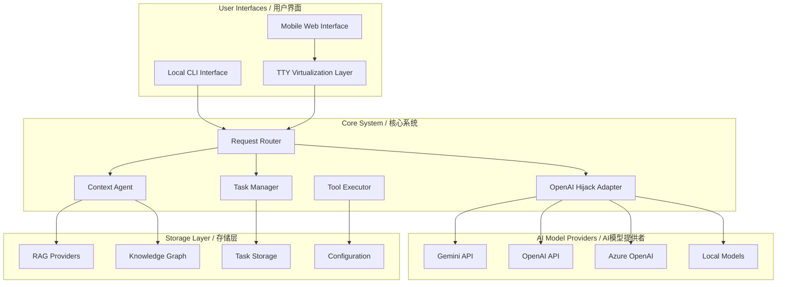

# Enhanced CLI System Design Document / 增强CLI系统设计文档

## Overview / 概述

The Enhanced CLI System is a sophisticated command-line AI workflow tool that extends the existing Gemini CLI with advanced capabilities including OpenAI mode hijacking, intelligent task management, context-aware analysis, and remote access support. The system provides seamless integration between different AI models while maintaining sophisticated workflow automation and comprehensive context understanding.

增强CLI系统是一个复杂的命令行AI工作流工具，扩展了现有的Gemini CLI，具备OpenAI模式劫持、智能任务管理、上下文感知分析和远程访问支持等高级功能。系统在不同AI模型之间提供无缝集成，同时保持复杂的工作流自动化和全面的上下文理解。

### Design Principles / 设计原则

1. **Modular Architecture**: Bacterial programming pattern with small, self-contained components
2. **Provider Abstraction**: Pluggable system for different AI models, RAG providers, and storage backends
3. **Context Separation**: Clear distinction between conversation history and contextual information
4. **Project Isolation**: Clean separation of data and contexts across different projects
5. **Backward Compatibility**: Seamless integration with existing Gemini CLI functionality

## Architecture / 架构

### High-Level System Architecture / 高级系统架构



### Component Architecture / 组件架构

The system follows a modular, bacterial programming approach where each component is small, focused, and independently testable.

#### 1. OpenAI Hijacking System / OpenAI劫持系统

**Design Rationale**: Provides transparent compatibility with OpenAI-compatible APIs while maintaining all existing functionality.

```typescript
interface OpenAIHijackAdapter {
  interceptRequest(request: OpenAIRequest): Promise<GeminiRequest>
  transformResponse(response: GeminiResponse): Promise<OpenAIResponse>
  generateToolGuidance(tools: Tool[]): string
  parseToolCalls(content: string, format: ToolCallFormat): ToolCall[]
}
```

**Key Components**:
- **Request Interceptor**: Captures and transforms OpenAI API calls
- **Format Converter**: Bidirectional conversion between API formats
- **Tool Call Parser**: Multi-format support (JSON, descriptive, content isolation)
- **Provider Router**: Intelligent routing to appropriate AI providers

#### 2. Context Management System / 上下文管理系统

**Design Rationale**: Provides intelligent context understanding through real-time analysis, RAG integration, and knowledge graph construction.

```typescript
interface ContextAgent {
  injectContextIntoDynamicSystem(input: string): Promise<ContextResult>
  analyzeModelResponse(response: string): Promise<AnalysisResult>
  updateKnowledgeGraph(entities: Entity[], relationships: Relationship[]): void
  getRelevantContext(query: string, maxTokens: number): Promise<Context>
}
```

**Key Components**:
- **Context Injector**: Real-time input and response analysis
- **RAG System**: Modular retrieval-augmented generation with provider abstraction
- **Knowledge Graph**: Project structure understanding and relationship mapping
- **Layered Context Manager**: Intelligent context prioritization and compression

#### 3. Task Management System / 任务管理系统

**Design Rationale**: Enables complex workflow automation with intelligent task breakdown, state tracking, and recovery mechanisms.

```typescript
interface TaskManager {
  createTasks(input: string): Promise<Task[]>
  getCurrentTask(): Promise<Task | null>
  finishCurrentTask(result: TaskResult): Promise<void>
  updateTaskStatus(taskId: string, status: TaskStatus): Promise<void>
  enterMaintenanceMode(): Promise<void>
}
```

**Key Components**:
- **Task Creator**: Intelligent workflow analysis and task breakdown
- **State Tracker**: Complete task lifecycle management
- **Progress Monitor**: Real-time status updates and completion tracking
- **Recovery Handler**: Graceful failure handling and alternative approaches

## Components and Interfaces / 组件和接口

### 1. OpenAI Hijacking Module / OpenAI劫持模块

#### Request Transformation Pipeline / 请求转换管道

```typescript
class OpenAIHijackAdapter {
  private conversationHistory: ConversationHistoryManager
  private toolGuidanceGenerator: ToolGuidanceGenerator
  private responseHandler: ResponseHandler
  
  async interceptRequest(request: OpenAIRequest): Promise<GeminiRequest> {
    // Transform OpenAI format to Gemini format
    const geminiRequest = this.convertToGeminiFormat(request)
    
    // Inject context if available
    const contextualRequest = await this.injectContext(geminiRequest)
    
    // Add tool guidance for non-tool-calling models
    if (!this.supportsNativeToolCalling(request.model)) {
      contextualRequest.content += this.generateToolGuidance(request.tools)
    }
    
    return contextualRequest
  }
  
  async parseToolCalls(content: string, format: ToolCallFormat): Promise<ToolCall[]> {
    switch (format) {
      case 'json':
        return this.parseJSONToolCalls(content)
      case 'descriptive':
        return this.parseDescriptiveToolCalls(content)
      case 'content_isolation':
        return this.parseContentIsolationToolCalls(content)
    }
  }
}
```

#### Tool Call Format Support / 工具调用格式支持

**JSON Format**: Standard structured tool calls
```json
{
  "tool_calls": [
    {
      "name": "write_file",
      "parameters": {
        "path": "example.txt",
        "content": "Hello World"
      }
    }
  ]
}
```

**Descriptive Format**: Natural language tool descriptions
```
I need to write a file called example.txt with the content "Hello World". 
Tool: write_file
Path: example.txt
Content: Hello World
```

**Content Isolation Format**: Structured content with markers
```
<*#*#CONTENT#*#*>
{
  "tool": "write_file",
  "path": "example.txt", 
  "content": "Hello World"
}
</*#*#CONTENT#*#*>
```

### 2. Context Management Architecture / 上下文管理架构

#### Layered Context System / 分层上下文系统

```typescript
class LayeredContextManager {
  private layers: ContextLayer[] = [
    new SystemContextLayer(),      // Runtime environment, session info
    new StaticContextLayer(),      // Project rules, memories, file structure  
    new DynamicContextLayer(),     // Real-time analysis, RAG results
    new ConversationContextLayer() // User messages, tool calls, responses
  ]
  
  async buildContext(query: string, tokenBudget: number): Promise<Context> {
    const context = new Context()
    let remainingTokens = tokenBudget
    
    for (const layer of this.layers) {
      const layerContext = await layer.getRelevantContext(query, remainingTokens)
      context.merge(layerContext)
      remainingTokens -= layerContext.tokenCount
      
      if (remainingTokens <= 0) break
    }
    
    return context
  }
}
```

#### RAG Provider Abstraction / RAG提供者抽象

```typescript
interface RAGProvider {
  name: string
  initialize(projectPath: string): Promise<void>
  indexDocument(document: Document): Promise<void>
  search(query: string, limit: number): Promise<SearchResult[]>
  updateIndex(): Promise<void>
  cleanup(): Promise<void>
}

class LightRAGProvider implements RAGProvider {
  // LightRAG-inspired implementation with graph-based retrieval
}

class LlamaIndexProvider implements RAGProvider {
  // LlamaIndex integration for document indexing
}
```

#### Knowledge Graph Integration / 知识图谱集成

```typescript
interface KnowledgeGraphProvider {
  addNode(node: GraphNode): Promise<void>
  addEdge(edge: GraphEdge): Promise<void>
  findRelated(nodeId: string, depth: number): Promise<GraphNode[]>
  analyzeProjectStructure(projectPath: string): Promise<ProjectGraph>
}

class GraphologyProvider implements KnowledgeGraphProvider {
  // In-memory graph processing using graphology
}

class Neo4jProvider implements KnowledgeGraphProvider {
  // Enterprise graph database integration
}
```

### 3. Task Management Architecture / 任务管理架构

#### Task State Machine / 任务状态机

```typescript
enum TaskStatus {
  PENDING = 'pending',
  IN_PROGRESS = 'in_progress', 
  COMPLETED = 'completed',
  FAILED = 'failed',
  BLOCKED = 'blocked'
}

class Task {
  id: string
  description: string
  status: TaskStatus
  dependencies: string[]
  createdAt: Date
  updatedAt: Date
  metadata: TaskMetadata
  
  canStart(): boolean {
    return this.dependencies.every(depId => 
      this.getTask(depId).status === TaskStatus.COMPLETED
    )
  }
}
```

#### Maintenance Mode / 维护模式

**Design Rationale**: Provides focused execution environment for complex multi-step workflows by temporarily isolating task execution.

```typescript
class MaintenanceMode {
  private isActive: boolean = false
  private currentWorkflow: Workflow
  private suspendedTasks: Task[]
  
  async enter(workflow: Workflow): Promise<void> {
    this.isActive = true
    this.currentWorkflow = workflow
    this.suspendedTasks = await this.suspendNonWorkflowTasks()
    
    // Focus only on workflow tasks
    await this.prioritizeWorkflowTasks(workflow.tasks)
  }
  
  async exit(): Promise<void> {
    this.isActive = false
    await this.resumeSuspendedTasks()
    this.currentWorkflow = null
  }
}
```

## Data Models / 数据模型

### Configuration Model / 配置模型

```typescript
interface ProjectConfiguration {
  version: string
  projectId: string
  debugMode: boolean
  
  contextAgent: {
    enabled: boolean
    ragProvider: 'lightrag' | 'llamaindex' | 'custom'
    knowledgeGraphProvider: 'graphology' | 'neo4j' | 'networkx'
    vectorProvider: 'local' | 'faiss' | 'custom'
    analysisMode: 'static' | 'dynamic' | 'hybrid'
  }
  
  taskManagement: {
    enabled: boolean
    maxTasks: number
    autoTaskCreation: boolean
    maintenanceMode: boolean
  }
  
  openaiMode: {
    enabled: boolean
    activeProvider: 'openai' | 'azure' | 'anthropic' | 'lmstudio'
    forceToolCalls: boolean
    contentIsolation: boolean
  }
}
```

### Context Data Model / 上下文数据模型

```typescript
interface Context {
  systemContext: SystemContext
  staticContext: StaticContext
  dynamicContext: DynamicContext
  conversationContext: ConversationContext
  tokenCount: number
  
  merge(other: Context): void
  compress(targetTokens: number): Context
  serialize(): string
}

interface SystemContext {
  runtime: RuntimeInfo
  session: SessionInfo
  environment: EnvironmentInfo
}

interface StaticContext {
  projectRules: Rule[]
  memories: Memory[]
  fileStructure: FileTree
  dependencies: Dependency[]
}

interface DynamicContext {
  ragResults: RAGResult[]
  graphAnalysis: GraphAnalysis
  realtimeInsights: Insight[]
}
```

### Task Data Model / 任务数据模型

```typescript
interface TaskContext {
  tasks: Task[]
  currentTaskId: string | null
  completedTasks: string[]
  failedTasks: FailedTask[]
  maintenanceMode: boolean
  
  workflows: Workflow[]
  templates: WorkflowTemplate[]
}

interface Workflow {
  id: string
  name: string
  description: string
  tasks: Task[]
  dependencies: WorkflowDependency[]
  status: WorkflowStatus
}
```

## Error Handling / 错误处理

### Graceful Degradation Strategy / 优雅降级策略

**Design Rationale**: Ensures system continues to function even when individual components fail, providing fallback mechanisms at every level.

```typescript
class ErrorHandler {
  async handleProviderFailure(provider: string, error: Error): Promise<void> {
    // Log error with context
    this.logger.error(`Provider ${provider} failed`, { error, context: this.getContext() })
    
    // Attempt fallback to next available provider
    const fallbackProvider = this.getNextAvailableProvider(provider)
    if (fallbackProvider) {
      await this.switchProvider(fallbackProvider)
      return
    }
    
    // If no fallback available, degrade gracefully
    await this.enterDegradedMode(provider)
  }
  
  async handleTaskFailure(task: Task, error: Error): Promise<void> {
    // Mark task as failed
    task.status = TaskStatus.FAILED
    task.error = error
    
    // Suggest recovery options
    const recoveryOptions = await this.generateRecoveryOptions(task, error)
    
    // Attempt automatic recovery if possible
    if (recoveryOptions.autoRecoverable) {
      await this.attemptAutoRecovery(task, recoveryOptions)
    } else {
      // Present manual recovery options to user
      await this.presentRecoveryOptions(task, recoveryOptions)
    }
  }
}
```

### Recovery Mechanisms / 恢复机制

1. **Provider Fallback**: Automatic switching to alternative AI providers
2. **Task Recovery**: Alternative approaches for failed tasks
3. **Context Reconstruction**: Rebuilding context from available sources
4. **Configuration Reset**: Fallback to default configurations
5. **Data Recovery**: Restoration from backup storage

## Testing Strategy / 测试策略

### Unit Testing / 单元测试

```typescript
describe('OpenAIHijackAdapter', () => {
  it('should transform OpenAI requests to Gemini format', async () => {
    const adapter = new OpenAIHijackAdapter()
    const openaiRequest = createMockOpenAIRequest()
    
    const geminiRequest = await adapter.interceptRequest(openaiRequest)
    
    expect(geminiRequest).toMatchGeminiFormat()
    expect(geminiRequest.tools).toEqual(openaiRequest.tools)
  })
  
  it('should parse tool calls in multiple formats', async () => {
    const adapter = new OpenAIHijackAdapter()
    const content = '<*#*#CONTENT#*#*>{"tool": "write_file"}</*#*#CONTENT#*#*>'
    
    const toolCalls = await adapter.parseToolCalls(content, 'content_isolation')
    
    expect(toolCalls).toHaveLength(1)
    expect(toolCalls[0].name).toBe('write_file')
  })
})
```

### Integration Testing / 集成测试

```typescript
describe('Context Management Integration', () => {
  it('should maintain context across model switches', async () => {
    const contextManager = new ContextManager()
    await contextManager.initialize(testProjectPath)
    
    // Start with Gemini
    await contextManager.processInput('Create a new file', 'gemini')
    
    // Switch to OpenAI
    await contextManager.switchModel('openai')
    
    // Context should be preserved
    const context = await contextManager.getCurrentContext()
    expect(context.conversationHistory).toContainFileCreationRequest()
  })
})
```

### End-to-End Testing / 端到端测试

```typescript
describe('Enhanced CLI System E2E', () => {
  it('should complete complex workflow with task management', async () => {
    const cli = new EnhancedCLI()
    await cli.initialize()
    
    // Start complex workflow
    const result = await cli.processInput(
      'Create a React component with tests and documentation'
    )
    
    // Should break down into tasks
    expect(result.tasks).toHaveLength(3)
    expect(result.tasks[0].description).toContain('Create React component')
    expect(result.tasks[1].description).toContain('Write tests')
    expect(result.tasks[2].description).toContain('Add documentation')
    
    // Execute tasks
    for (const task of result.tasks) {
      await cli.executeTask(task.id)
    }
    
    // Verify completion
    const finalState = await cli.getTaskState()
    expect(finalState.completedTasks).toHaveLength(3)
  })
})
```

## Performance Considerations / 性能考虑

### Context Management Optimization / 上下文管理优化

**Design Rationale**: Intelligent context compression and caching to handle large projects efficiently while maintaining relevance.

1. **Token Budget Management**: Dynamic allocation based on model limits
2. **Context Caching**: 24-hour expiration with intelligent invalidation
3. **Lazy Loading**: Load context components only when needed
4. **Compression Algorithms**: Semantic compression for large contexts
5. **Parallel Processing**: Concurrent RAG and graph analysis

### Storage Optimization / 存储优化

1. **Project Isolation**: Separate storage prevents cross-project contamination
2. **Provider Modularity**: Pluggable storage backends for different needs
3. **Incremental Updates**: Only update changed portions of knowledge graphs
4. **Cleanup Strategies**: Automatic removal of stale data
5. **Compression**: Efficient storage of large context data

## Security Considerations / 安全考虑

### API Key Management / API密钥管理

```typescript
class SecureConfigManager {
  private encryptionKey: string
  
  async storeAPIKey(provider: string, key: string): Promise<void> {
    const encrypted = await this.encrypt(key)
    await this.storage.set(`api_key_${provider}`, encrypted)
  }
  
  async getAPIKey(provider: string): Promise<string> {
    const encrypted = await this.storage.get(`api_key_${provider}`)
    return await this.decrypt(encrypted)
  }
}
```

### Sandboxing / 沙箱化

1. **Tool Execution Sandboxing**: Dangerous tools require explicit approval
2. **File System Isolation**: Restrict access to project directories
3. **Network Isolation**: Control external API access
4. **Process Isolation**: Separate execution contexts for different operations

### Data Privacy / 数据隐私

1. **Local Storage**: All context data stored locally by default
2. **Encryption**: Sensitive data encrypted at rest
3. **Access Control**: Project-level access restrictions
4. **Audit Logging**: Track all data access and modifications

## Deployment Architecture / 部署架构

### Local Development / 本地开发

```bash
# Standard development setup
npm install
npm run build
npm start

# With OpenAI mode
HIJACK_ENABLED=true HIJACK_ACTIVE_PROVIDER=OPENAI npm start

# With advanced features
GEMINI_CONTEXT_AGENT=true GRAPH_RAG_ENABLED=true npm start
```

### Server Mode (Planned) / 服务器模式（计划中）

```typescript
class EnhancedCLIServer {
  private ttyVirtualizer: TTYVirtualizer
  private webInterface: MobileWebInterface
  private sessionManager: SessionManager
  
  async start(port: number): Promise<void> {
    // Initialize TTY virtualization
    await this.ttyVirtualizer.initialize()
    
    // Start web server for mobile interface
    await this.webInterface.start(port)
    
    // Setup session management
    await this.sessionManager.initialize()
  }
}
```

### Configuration Management / 配置管理

**Hierarchical Configuration System**:
1. **Project Level**: `./.gemini/` - Project-specific overrides
2. **Global Level**: `~/.gemini/` - User defaults
3. **Environment Variables**: Runtime configuration
4. **Default Values**: Fallback configuration

## Migration Strategy / 迁移策略

### Backward Compatibility / 向后兼容性

**Design Rationale**: Ensure existing Gemini CLI users can adopt the enhanced system without breaking changes.

1. **Gradual Feature Adoption**: All enhanced features are opt-in
2. **Configuration Migration**: Automatic migration of existing configurations
3. **Data Preservation**: Existing data structures remain compatible
4. **API Compatibility**: Maintain existing CLI command interface

### Upgrade Path / 升级路径

1. **Phase 1**: Install enhanced CLI alongside existing installation
2. **Phase 2**: Migrate configuration and enable basic features
3. **Phase 3**: Enable advanced features (OpenAI mode, context agent)
4. **Phase 4**: Full feature adoption with server mode and mobile access

This design provides a comprehensive foundation for implementing the enhanced CLI system while maintaining modularity, extensibility, and backward compatibility.