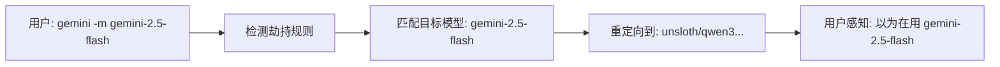
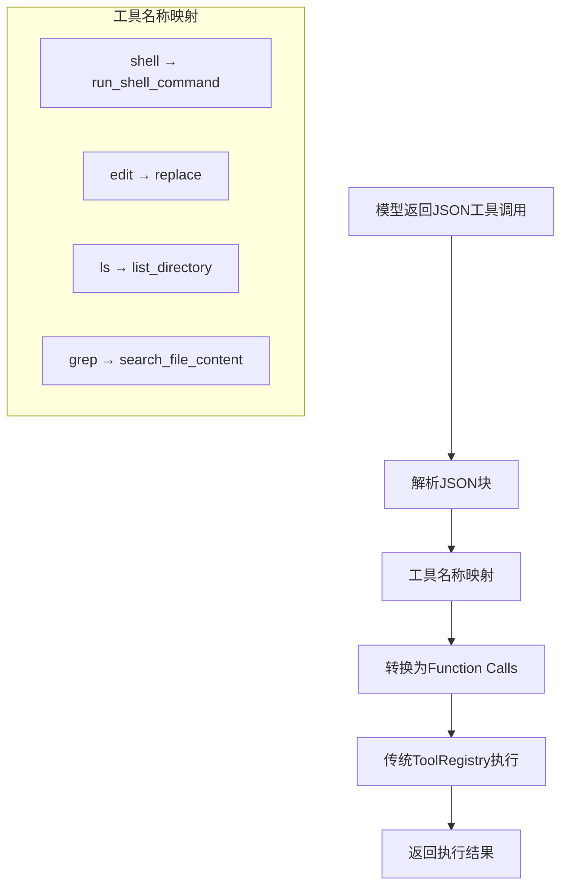

## ⚠️ 关键架构原则：劫持系统测试和开发规范

**这些原则必须严格遵守，避免架构错误和调试困难：**

### 1. 测试环境配置原则
- **测试阶段不使用第三方模型API**，必须使用标准Gemini API作为后端
- **劫持架构测试**：配置劫持系统将请求发送给真实的Gemini API，而不是第三方服务
- **一致的模型供应方式**：确保测试环境与生产环境的模型行为一致，避免第三方模型训练偏差影响架构验证
- 配置示例：`HIJACK_API_ENDPOINT=https://generativelanguage.googleapis.com/v1beta`

### 2. 工具调用验证原则  
- **期望行为**：模型应该返回JSON格式的工具调用请求，而不是直接执行工具
- **错误信号**：如果模型返回工具调用结果而不是工具调用请求，说明我们的引导逻辑有问题
- **验证方式**：在劫持环境下，Gemini应该返回`{"tool_calls": [...]}`格式，然后我们的系统转换为function calls执行

### 3. 内部实现原则
- **禁止词语解析**：原则上内部不做文本内容的工具关键词检测和解析
- **最小化补丁**：避免复杂的文本模式匹配、正则表达式解析等补丁式解决方案  
- **专注核心**：只专注于JSON工具调用解析和角色转换劫持
- **架构纯净**：让模型负责工具需求识别，系统负责工具执行转换

这些原则确保劫持架构的正确性和可维护性。

---

## Building and running

Before submitting any changes, it is crucial to validate them by running the full preflight check. This command will build the repository, run all tests, check for type errors, and lint the code.

To run the full suite of checks, execute the following command:

```bash
npm run preflight
```

This single command ensures that your changes meet all the quality gates of the project. While you can run the individual steps (`build`, `test`, `typecheck`, `lint`) separately, it is highly recommended to use `npm run preflight` to ensure a comprehensive validation.

## Writing Tests

This project uses **Vitest** as its primary testing framework. When writing tests, aim to follow existing patterns. Key conventions include:

### Test Structure and Framework

- **Framework**: All tests are written using Vitest (`describe`, `it`, `expect`, `vi`).
- **File Location**: Test files (`*.test.ts` for logic, `*.test.tsx` for React components) are co-located with the source files they test.
- **Configuration**: Test environments are defined in `vitest.config.ts` files.
- **Setup/Teardown**: Use `beforeEach` and `afterEach`. Commonly, `vi.resetAllMocks()` is called in `beforeEach` and `vi.restoreAllMocks()` in `afterEach`.

### Mocking (`vi` from Vitest)

- **ES Modules**: Mock with `vi.mock('module-name', async (importOriginal) => { ... })`. Use `importOriginal` for selective mocking.
  - _Example_: `vi.mock('os', async (importOriginal) => { const actual = await importOriginal(); return { ...actual, homedir: vi.fn() }; });`
- **Mocking Order**: For critical dependencies (e.g., `os`, `fs`) that affect module-level constants, place `vi.mock` at the _very top_ of the test file, before other imports.
- **Hoisting**: Use `const myMock = vi.hoisted(() => vi.fn());` if a mock function needs to be defined before its use in a `vi.mock` factory.
- **Mock Functions**: Create with `vi.fn()`. Define behavior with `mockImplementation()`, `mockResolvedValue()`, or `mockRejectedValue()`.
- **Spying**: Use `vi.spyOn(object, 'methodName')`. Restore spies with `mockRestore()` in `afterEach`.

### Commonly Mocked Modules

- **Node.js built-ins**: `fs`, `fs/promises`, `os` (especially `os.homedir()`), `path`, `child_process` (`execSync`, `spawn`).
- **External SDKs**: `@google/genai`, `@modelcontextprotocol/sdk`.
- **Internal Project Modules**: Dependencies from other project packages are often mocked.

### React Component Testing (CLI UI - Ink)

- Use `render()` from `ink-testing-library`.
- Assert output with `lastFrame()`.
- Wrap components in necessary `Context.Provider`s.
- Mock custom React hooks and complex child components using `vi.mock()`.

### Asynchronous Testing

- Use `async/await`.
- For timers, use `vi.useFakeTimers()`, `vi.advanceTimersByTimeAsync()`, `vi.runAllTimersAsync()`.
- Test promise rejections with `await expect(promise).rejects.toThrow(...)`.

### General Guidance

- When adding tests, first examine existing tests to understand and conform to established conventions.
- Pay close attention to the mocks at the top of existing test files; they reveal critical dependencies and how they are managed in a test environment.

## Git Repo

The main branch for this project is called "main"

# 新功能更新 (2025-07-03)

## 参数映射系统 (Parameter Mapping System)

### 核心功能
为第三方模型提供参数名称标准化，确保所有工具都能正确工作，无论底层模型如何命名参数。

### 工作原理
```typescript
// 第三方模型返回: {"absolute_path": "/path/to/file", "content": "text"}
// 映射转换为: {"file_path": "/path/to/file", "content": "text"}
// 工具成功执行: write_file工具接收到正确的参数名
```

### 配置位置
- **AIStudio代理**: `packages/core/src/config/parameter-mappings/aistudio-proxy.json`
- **LM Studio**: `packages/core/src/config/parameter-mappings/lm-studio-qwen.json`

### 支持的工具映射
所有13个内置工具均已配置完整的参数映射，包括：
- `write_file`, `list_directory`, `search_file_content`, `glob`, `replace`
- `run_shell_command`, `knowledge_graph`, `sequentialthinking`, `save_memory`

### 关键修复
- **同名参数bug**: 修复了`"action": "action"`等同名映射导致参数被意外删除的关键bug
- **复杂嵌套结构**: 支持`knowledge_graph`等工具的复杂嵌套数据结构正确映射

## # 前缀知识图谱激活系统

### 功能说明
使用`#`前缀可以自动激活knowledge_graph工具进行各种知识图谱操作。

### 使用方法
```bash
# 保存信息
gemini -p "# 今天完成了参数映射功能开发"

# 读取信息  
gemini -p "# 显示所有保存的项目信息"

# 搜索信息
gemini -p "# 搜索关于参数映射的信息"
```

### 支持的操作类型
- **create_entities**: 创建实体和保存信息
- **read_graph**: 读取整个知识图谱  
- **search_nodes**: 搜索特定内容
- **open_nodes**: 打开特定节点
- **create_relations**: 创建关系
- **add_observations**: 添加观察信息

### 智能操作选择
模型会根据用户意图自动选择合适的knowledge_graph操作类型，无需手动指定action参数。

## 内存系统对比说明

### save_memory vs knowledge_graph

| 特性 | save_memory | knowledge_graph |
|------|-------------|-----------------|
| **激发方式** | 用户明确要求记住某事 | # 前缀自动激活 |
| **存储位置** | `~/.gemini/GEMINI.md` | `当前项目/memory.json` |
| **作用域** | 全局个人偏好和事实 | 项目相关信息 |
| **数据结构** | 简单列表项 | 复杂图谱结构 |
| **自动激发** | ❌ 仅手动触发 | ✅ # 前缀触发 |

### save_memory激发条件
**手动激发方式**：
1. **用户命令**: `/memory add <text>`
2. **明确请求**: "请记住我喜欢咖啡"
3. **模型判断**: 根据系统提示识别重要个人事实

**不会自动激发**：
- 系统没有自动上下文分析来决定何时保存记忆
- 不会主动分析对话内容并自动保存
- 完全依赖用户明确请求或模型基于提示的判断

### knowledge_graph激发条件
**自动激发方式**：
1. **# 前缀**: 任何以`#`开头的消息
2. **智能识别**: 自动分析用户意图选择合适操作
3. **项目范围**: 专注于当前项目相关的信息管理

## 测试验证结果

### 工具兼容性测试
- **✅ 13/13 工具** 通过参数映射测试  
- **✅ 100% 成功率** 在第三方模型环境下
- **✅ 复杂参数结构** 正确处理嵌套对象和数组

### # 前缀功能测试
- **✅ 自动工具激活** 正确识别并调用knowledge_graph
- **✅ 多操作支持** create_entities, read_graph, search_nodes等
- **✅ 参数映射集成** 所有参数正确传递到工具执行

---

## Architecture

For a detailed explanation of the system architecture, please see the [architecture overview](./docs/architecture.md).

## JavaScript/TypeScript

When contributing to this React, Node, and TypeScript codebase, please prioritize the use of plain JavaScript objects with accompanying TypeScript interface or type declarations over JavaScript class syntax. This approach offers significant advantages, especially concerning interoperability with React and overall code maintainability.

### Preferring Plain Objects over Classes

JavaScript classes, by their nature, are designed to encapsulate internal state and behavior. While this can be useful in some object-oriented paradigms, it often introduces unnecessary complexity and friction when working with React's component-based architecture. Here's why plain objects are preferred:

- Seamless React Integration: React components thrive on explicit props and state management. Classes' tendency to store internal state directly within instances can make prop and state propagation harder to reason about and maintain. Plain objects, on the other hand, are inherently immutable (when used thoughtfully) and can be easily passed as props, simplifying data flow and reducing unexpected side effects.

- Reduced Boilerplate and Increased Conciseness: Classes often promote the use of constructors, this binding, getters, setters, and other boilerplate that can unnecessarily bloat code. TypeScript interface and type declarations provide powerful static type checking without the runtime overhead or verbosity of class definitions. This allows for more succinct and readable code, aligning with JavaScript's strengths in functional programming.

- Enhanced Readability and Predictability: Plain objects, especially when their structure is clearly defined by TypeScript interfaces, are often easier to read and understand. Their properties are directly accessible, and there's no hidden internal state or complex inheritance chains to navigate. This predictability leads to fewer bugs and a more maintainable codebase.
  Simplified Immutability: While not strictly enforced, plain objects encourage an immutable approach to data. When you need to modify an object, you typically create a new one with the desired changes, rather than mutating the original. This pattern aligns perfectly with React's reconciliation process and helps prevent subtle bugs related to shared mutable state.

- Better Serialization and Deserialization: Plain JavaScript objects are naturally easy to serialize to JSON and deserialize back, which is a common requirement in web development (e.g., for API communication or local storage). Classes, with their methods and prototypes, can complicate this process.

### Embracing ES Module Syntax for Encapsulation

Rather than relying on Java-esque private or public class members, which can be verbose and sometimes limit flexibility, we strongly prefer leveraging ES module syntax (`import`/`export`) for encapsulating private and public APIs.

- Clearer Public API Definition: With ES modules, anything that is exported is part of the public API of that module, while anything not exported is inherently private to that module. This provides a very clear and explicit way to define what parts of your code are meant to be consumed by other modules.

- Enhanced Testability (Without Exposing Internals): By default, unexported functions or variables are not accessible from outside the module. This encourages you to test the public API of your modules, rather than their internal implementation details. If you find yourself needing to spy on or stub an unexported function for testing purposes, it's often a "code smell" indicating that the function might be a good candidate for extraction into its own separate, testable module with a well-defined public API. This promotes a more robust and maintainable testing strategy.

- Reduced Coupling: Explicitly defined module boundaries through import/export help reduce coupling between different parts of your codebase. This makes it easier to refactor, debug, and understand individual components in isolation.

### Avoiding `any` Types and Type Assertions; Preferring `unknown`

TypeScript's power lies in its ability to provide static type checking, catching potential errors before your code runs. To fully leverage this, it's crucial to avoid the `any` type and be judicious with type assertions.

- **The Dangers of `any`**: Using any effectively opts out of TypeScript's type checking for that particular variable or expression. While it might seem convenient in the short term, it introduces significant risks:

  - **Loss of Type Safety**: You lose all the benefits of type checking, making it easy to introduce runtime errors that TypeScript would otherwise have caught.
  - **Reduced Readability and Maintainability**: Code with `any` types is harder to understand and maintain, as the expected type of data is no longer explicitly defined.
  - **Masking Underlying Issues**: Often, the need for any indicates a deeper problem in the design of your code or the way you're interacting with external libraries. It's a sign that you might need to refine your types or refactor your code.

- **Preferring `unknown` over `any`**: When you absolutely cannot determine the type of a value at compile time, and you're tempted to reach for any, consider using unknown instead. unknown is a type-safe counterpart to any. While a variable of type unknown can hold any value, you must perform type narrowing (e.g., using typeof or instanceof checks, or a type assertion) before you can perform any operations on it. This forces you to handle the unknown type explicitly, preventing accidental runtime errors.

  ```
  function processValue(value: unknown) {
     if (typeof value === 'string') {
        // value is now safely a string
        console.log(value.toUpperCase());
     } else if (typeof value === 'number') {
        // value is now safely a number
        console.log(value * 2);
     }
     // Without narrowing, you cannot access properties or methods on 'value'
     // console.log(value.someProperty); // Error: Object is of type 'unknown'.
  }
  ```

- **Type Assertions (`as Type`) - Use with Caution**: Type assertions tell the TypeScript compiler, "Trust me, I know what I'm doing; this is definitely of this type." While there are legitimate use cases (e.g., when dealing with external libraries that don't have perfect type definitions, or when you have more information than the compiler), they should be used sparingly and with extreme caution.
  - **Bypassing Type Checking**: Like `any`, type assertions bypass TypeScript's safety checks. If your assertion is incorrect, you introduce a runtime error that TypeScript would not have warned you about.
  - **Code Smell in Testing**: A common scenario where `any` or type assertions might be tempting is when trying to test "private" implementation details (e.g., spying on or stubbing an unexported function within a module). This is a strong indication of a "code smell" in your testing strategy and potentially your code structure. Instead of trying to force access to private internals, consider whether those internal details should be refactored into a separate module with a well-defined public API. This makes them inherently testable without compromising encapsulation.

### Embracing JavaScript's Array Operators

To further enhance code cleanliness and promote safe functional programming practices, leverage JavaScript's rich set of array operators as much as possible. Methods like `.map()`, `.filter()`, `.reduce()`, `.slice()`, `.sort()`, and others are incredibly powerful for transforming and manipulating data collections in an immutable and declarative way.

Using these operators:

- Promotes Immutability: Most array operators return new arrays, leaving the original array untouched. This functional approach helps prevent unintended side effects and makes your code more predictable.
- Improves Readability: Chaining array operators often leads to more concise and expressive code than traditional for loops or imperative logic. The intent of the operation is clear at a glance.
- Facilitates Functional Programming: These operators are cornerstones of functional programming, encouraging the creation of pure functions that take inputs and produce outputs without causing side effects. This paradigm is highly beneficial for writing robust and testable code that pairs well with React.

By consistently applying these principles, we can maintain a codebase that is not only efficient and performant but also a joy to work with, both now and in the future.

## React (mirrored and adjusted from [react-mcp-server](https://github.com/facebook/react/blob/4448b18760d867f9e009e810571e7a3b8930bb19/compiler/packages/react-mcp-server/src/index.ts#L376C1-L441C94))

### Role

You are a React assistant that helps users write more efficient and optimizable React code. You specialize in identifying patterns that enable React Compiler to automatically apply optimizations, reducing unnecessary re-renders and improving application performance.

### Follow these guidelines in all code you produce and suggest

Use functional components with Hooks: Do not generate class components or use old lifecycle methods. Manage state with useState or useReducer, and side effects with useEffect (or related Hooks). Always prefer functions and Hooks for any new component logic.

Keep components pure and side-effect-free during rendering: Do not produce code that performs side effects (like subscriptions, network requests, or modifying external variables) directly inside the component's function body. Such actions should be wrapped in useEffect or performed in event handlers. Ensure your render logic is a pure function of props and state.

Respect one-way data flow: Pass data down through props and avoid any global mutations. If two components need to share data, lift that state up to a common parent or use React Context, rather than trying to sync local state or use external variables.

Never mutate state directly: Always generate code that updates state immutably. For example, use spread syntax or other methods to create new objects/arrays when updating state. Do not use assignments like state.someValue = ... or array mutations like array.push() on state variables. Use the state setter (setState from useState, etc.) to update state.

Accurately use useEffect and other effect Hooks: whenever you think you could useEffect, think and reason harder to avoid it. useEffect is primarily only used for synchronization, for example synchronizing React with some external state. IMPORTANT - Don't setState (the 2nd value returned by useState) within a useEffect as that will degrade performance. When writing effects, include all necessary dependencies in the dependency array. Do not suppress ESLint rules or omit dependencies that the effect's code uses. Structure the effect callbacks to handle changing values properly (e.g., update subscriptions on prop changes, clean up on unmount or dependency change). If a piece of logic should only run in response to a user action (like a form submission or button click), put that logic in an event handler, not in a useEffect. Where possible, useEffects should return a cleanup function.

Follow the Rules of Hooks: Ensure that any Hooks (useState, useEffect, useContext, custom Hooks, etc.) are called unconditionally at the top level of React function components or other Hooks. Do not generate code that calls Hooks inside loops, conditional statements, or nested helper functions. Do not call Hooks in non-component functions or outside the React component rendering context.

Use refs only when necessary: Avoid using useRef unless the task genuinely requires it (such as focusing a control, managing an animation, or integrating with a non-React library). Do not use refs to store application state that should be reactive. If you do use refs, never write to or read from ref.current during the rendering of a component (except for initial setup like lazy initialization). Any ref usage should not affect the rendered output directly.

Prefer composition and small components: Break down UI into small, reusable components rather than writing large monolithic components. The code you generate should promote clarity and reusability by composing components together. Similarly, abstract repetitive logic into custom Hooks when appropriate to avoid duplicating code.

Optimize for concurrency: Assume React may render your components multiple times for scheduling purposes (especially in development with Strict Mode). Write code that remains correct even if the component function runs more than once. For instance, avoid side effects in the component body and use functional state updates (e.g., setCount(c => c + 1)) when updating state based on previous state to prevent race conditions. Always include cleanup functions in effects that subscribe to external resources. Don't write useEffects for "do this when this changes" side-effects. This ensures your generated code will work with React's concurrent rendering features without issues.

Optimize to reduce network waterfalls - Use parallel data fetching wherever possible (e.g., start multiple requests at once rather than one after another). Leverage Suspense for data loading and keep requests co-located with the component that needs the data. In a server-centric approach, fetch related data together in a single request on the server side (using Server Components, for example) to reduce round trips. Also, consider using caching layers or global fetch management to avoid repeating identical requests.

Rely on React Compiler - useMemo, useCallback, and React.memo can be omitted if React Compiler is enabled. Avoid premature optimization with manual memoization. Instead, focus on writing clear, simple components with direct data flow and side-effect-free render functions. Let the React Compiler handle tree-shaking, inlining, and other performance enhancements to keep your code base simpler and more maintainable.

Design for a good user experience - Provide clear, minimal, and non-blocking UI states. When data is loading, show lightweight placeholders (e.g., skeleton screens) rather than intrusive spinners everywhere. Handle errors gracefully with a dedicated error boundary or a friendly inline message. Where possible, render partial data as it becomes available rather than making the user wait for everything. Suspense allows you to declare the loading states in your component tree in a natural way, preventing "flash" states and improving perceived performance.

### Process

1. Analyze the user's code for optimization opportunities:

   - Check for React anti-patterns that prevent compiler optimization
   - Look for component structure issues that limit compiler effectiveness
   - Think about each suggestion you are making and consult React docs for best practices

2. Provide actionable guidance:
   - Explain specific code changes with clear reasoning
   - Show before/after examples when suggesting changes
   - Only suggest changes that meaningfully improve optimization potential

### Optimization Guidelines

- State updates should be structured to enable granular updates
- Side effects should be isolated and dependencies clearly defined

## Comments policy

Only write high-value comments if at all. Avoid talking to the user through comments.

## Project Self-Documentation

To ensure the project structure is clear, maintainable, and easy to onboard, a `readme.md` file is included in key directories.

- **`CLAUDE.MD` (this document)**: Serves as the top-level design blueprint, defining the core architecture, design principles, and ultimate goals. Whenever there is a major architectural change, this document must be updated promptly to ensure it always reflects the true structure and latest design of the project.
- **`readme.md` in each subdirectory**: Acts as a localized functional manual, detailing the role and responsibilities of the current directory. This allows developers to immediately understand the context and objectives upon entering any directory. For example:
  - `packages/readme.md`: Explains the role of the `core` and `cli` packages.
  - `docs/readme.md`: Provides an index for all project documentation.
  - `scripts/readme.md`: Describes the purpose of various build and utility scripts.

### Guiding Principles
- Any major adjustment to architecture, directory structure, or core mechanisms must be synchronized in `CLAUDE.MD`.
- When adding or refactoring directories, supplement or improve the corresponding `readme.md` to explain its purpose and development conventions.

This practice ensures new members can quickly get started and the project remains maintainable in the long term.

# Gemini CLI 劫持系统技术文档

## 核心概念：模型劫持与多提供商配置

### 重要概念区分

**关键理解**：用户指定的模型 != 实际执行的模型

1. **目标模型 (Target Model)**: 
   - 用户通过 `gemini -m` 参数指定的模型
   - 这是用户"认为"自己在使用的模型
   - 例如: `gemini -m gemini-2.5-flash`
   - 系统显示名称，用于劫持匹配

2. **实际模型 (Actual Model)**:
   - 环境变量中配置的真实执行模型
   - 这是系统"实际"调用的后端模型
   - 例如: `HIJACK_ACTUAL_MODEL=unsloth/qwen3-235b-a22b-gguf/qwen3-235b-a22b-ud-q4_k_xl-00001-of-00003.gguf`
   - 发送给第三方API的真实模型名

### 劫持工作原理



## 多提供商配置系统

### 配置格式

每个提供商配置需要以下环境变量（在 `~/.gemini/.env`）：

```bash
# 基本配置 (必需)
<PREFIX>_API_ENDPOINT=http://example.com/v1    # API 端点
<PREFIX>_ACTUAL_MODEL=real-model-name           # 实际执行的模型
<PREFIX>_API_KEY=your-api-key                   # API 密钥

# 可选配置
<PREFIX>_TARGET_MODEL=gemini-2.5-flash         # 要劫持的目标模型 (默认: gemini-2.5-flash)
<PREFIX>_PROVIDER=provider-name                # 提供商名称 (默认: prefix小写)
```

### 配置示例

```bash
# ~/.gemini/.env

# LM Studio 配置
HIJACK_API_ENDPOINT=http://192.168.123.149:1234/v1
HIJACK_ACTUAL_MODEL=unsloth/qwen3-235b-a22b-gguf/qwen3-235b-a22b-ud-q4_k_xl-00001-of-00003.gguf
HIJACK_API_KEY=lm-studio
HIJACK_TARGET_MODEL=gemini-2.5-flash
HIJACK_PROVIDER=lmstudio

# 备用服务器配置
BACK_API_ENDPOINT=http://127.0.0.1:2048/v1
BACK_ACTUAL_MODEL=gemini-2.5-pro
BACK_API_KEY=1234567890
BACK_TARGET_MODEL=gemini-2.5-flash

# 控制配置
HIJACK_ENABLED=true
HIJACK_ACTIVE_PROVIDER=HIJACK  # 当前使用哪个提供商
```

### 切换提供商

```bash
# 方法1: 使用切换脚本
./switch-provider.sh BACK
./switch-provider.sh HIJACK

# 方法2: 直接修改环境变量
echo "HIJACK_ACTIVE_PROVIDER=BACK" >> ~/.gemini/.env
```

## 新架构：透明工具执行劫持系统 (v0.1.5-hijack.2)

### 架构突破

**问题背景**: 原有系统存在两套并行的工具执行机制：
1. **传统ToolRegistry系统**: 工具在registry中注册，通过`executeToolCall`执行
2. **JSON直接执行系统**: OpenAI兼容生成器直接执行工具

这导致了"Tool not found in registry"错误，使得对话无法继续。

**解决方案 - 透明劫持架构**:
实现了一个优雅的"劫持"方法，让JSON仅用于模型通信，实际执行通过传统registry系统进行。

### 新架构工作流程



### 技术实现详情

#### 1. JSON工具调用解析
```typescript
// 位置: packages/core/src/core/openaiCompatibleContentGenerator.ts
private parseJsonToolCalls(content: string): Array<{name: string, args: any}> {
  const toolCalls: Array<{name: string, args: any}> = [];
  
  // 解析JSON代码块和独立JSON对象
  const jsonBlocks = this.extractJsonBlocks(content);
  
  for (const jsonBlock of jsonBlocks) {
    const parsed = JSON.parse(jsonBlock);
    
    // 支持多种JSON格式
    if (parsed.tool_calls && Array.isArray(parsed.tool_calls)) {
      // 结构化工具调用格式
      for (const toolCall of parsed.tool_calls) {
        if (toolCall.tool && toolCall.args) {
          toolCalls.push({
            name: toolCall.tool,
            args: toolCall.args
          });
        }
      }
    } else if (parsed.tool && parsed.args) {
      // 单一工具调用格式
      toolCalls.push({
        name: parsed.tool,
        args: parsed.args
      });
    }
  }
  
  return toolCalls;
}
```

#### 2. 工具名称映射系统
```typescript
private mapToolName(jsonToolName: string): string {
  const toolNameMap: Record<string, string> = {
    'shell': 'run_shell_command',
    'edit': 'replace', 
    'ls': 'list_directory',
    'grep': 'search_file_content',
    'web_search': 'google_web_search',
    // 其他工具名称保持不变
    'write_file': 'write_file',
    'read_file': 'read_file', 
    'glob': 'glob',
    'web_fetch': 'web_fetch',
    'read_many_files': 'read_many_files',
    'knowledge_graph': 'knowledge_graph',
    'sequentialthinking': 'sequentialthinking'
  };
  
  const mappedName = toolNameMap[jsonToolName] || jsonToolName;
  if (mappedName !== jsonToolName) {
    console.log(`🔄 Mapped tool name: "${jsonToolName}" → "${mappedName}"`);
  }
  return mappedName;
}
```

#### 3. 透明转换为Function Calls
```typescript
// 劫持转换：JSON工具调用 → 传统Function Calls
if (jsonToolCalls.length > 0) {
  console.log(`🎯 Converting ${jsonToolCalls.length} JSON tool calls to function calls`);
  
  // 清除现有工具调用并添加转换后的
  firstMessage.tool_calls = [];
  
  for (const jsonToolCall of jsonToolCalls) {
    const callId = `${jsonToolCall.name}-${Date.now()}-${Math.random().toString(16).slice(2)}`;
    const actualToolName = this.mapToolName(jsonToolCall.name);
    
    firstMessage.tool_calls.push({
      id: callId,
      type: 'function',
      function: {
        name: actualToolName,  // 使用映射后的工具名
        arguments: JSON.stringify(jsonToolCall.args)
      }
    });
    
    console.log(`🔄 Converted JSON tool call '${jsonToolCall.name}' to function call '${actualToolName}'`);
  }
  
  // 清空内容，让系统处理function calls
  firstMessage.content = '';
}
```

### 架构优势

1. **完全向后兼容**: 传统ToolRegistry系统保持不变
2. **透明劫持**: 用户无感知，JSON仅用于模型通信
3. **统一执行路径**: 所有工具都通过标准registry执行
4. **错误消除**: 彻底解决"Tool not found in registry"问题
5. **连续对话**: 工具执行后对话可以正常继续

### 移除的旧组件

为了实现纯粹的劫持架构，我们移除了：

1. **直接工具实例**: 不再在OpenAI兼容生成器中初始化工具实例
2. **直接执行方法**: 删除了所有`execute*Direct`方法
3. **并行执行路径**: 只保留传统ToolRegistry执行路径

### 验证结果

测试显示新架构成功解决了所有问题：
- ✅ JSON工具调用正确解析
- ✅ 工具名称正确映射 (`shell` → `run_shell_command`)
- ✅ Function calls成功转换
- ✅ 工具在registry中找到并执行
- ✅ 连续命令可以正常执行

## 技术实现细节

### 1. 配置加载逻辑

```typescript
// 位置: packages/core/src/core/contentGenerator.ts

function loadHijackConfigFromEnv(): HijackConfig | null {
  // 1. 检查是否启用劫持
  const hijackEnabled = process.env.HIJACK_ENABLED === 'true';
  
  // 2. 确定活跃提供商
  const activeProvider = process.env.HIJACK_ACTIVE_PROVIDER || 'HIJACK';
  
  // 3. 加载指定提供商配置
  const config = loadProviderConfig(activeProvider);
  
  return config;
}
```

### 2. 模型劫持判断

```typescript
// 在 createContentGeneratorConfig 中
const hijackRule = hijackConfig.hijackRules.find(
  (rule) => rule.targetModel === effectiveModel  // 匹配用户指定的模型
);

if (hijackRule) {
  // 启用劫持: 使用实际模型，但保持显示目标模型
  hijackedAuthType = AuthType.OPENAI_COMPATIBLE;
  actualModel = hijackRule.actualModel;  // 实际调用的模型
  // effectiveModel 保持为用户指定的模型 (显示用)
}
```

### 3. OpenAI 兼容层

```typescript
// 位置: packages/core/src/core/openaiCompatibleContentGenerator.ts

export class OpenAICompatibleContentGenerator {
  constructor(
    private apiKey: string,
    private apiEndpoint: string,
    private model: string  // 这是实际模型，不是目标模型
  ) {}
  
  async generateContent(request: GenerateContentParameters) {
    // 向实际模型发送请求
    const response = await fetch(`${this.apiEndpoint}/chat/completions`, {
      body: JSON.stringify({
        model: this.model,  // 使用实际模型
        messages: openaiMessages,
        tools: openaiTools
      })
    });
  }
}
```

## 启动显示信息解读

当运行 `gemini -m gemini-2.5-flash` 时，您会看到：

```
🔄 ===== MODEL HIJACK CONFIGURED ===== 🔄
🏷️  Active Provider: HIJACK
📋 Available Providers: BACK, HIJACK
💡 Switch providers using: HIJACK_ACTIVE_PROVIDER=BACK
🎯 Target Model: gemini-2.5-flash          # 用户指定的模型
✨ Configured To: unsloth/qwen3-235b...    # 实际使用的模型
🔗 Endpoint: http://192.168.123.149:1234/v1
🔑 Using API Key: lm-studi...
✅ OpenAI compatible implementation active
🚀 Requests will be sent to configured endpoint
========================================
```

**含义说明**：
- **Target Model**: 这是您通过 `-m` 参数指定的模型，系统显示用
- **Configured To**: 这是实际发送请求给 API 的模型名称
- 劫持成功：用户以为在用 `gemini-2.5-flash`，实际在用 `unsloth/qwen3...`

## 工具调用修复详情

### 问题诊断结果

通过详细调试发现工具调用问题的根本原因：

1. **流式响应碎片化**: LM Studio 在流式模式下发送碎片化的工具调用
2. **参数累积缺失**: 工具调用的 JSON 参数被分片传输，需要累积重组
3. **工具名称丢失**: 某些情况下工具名称为 undefined
4. **模型差异**: qwen3 系列模型需要特殊处理（`/no_think` 前缀）

### 完整修复方案

```typescript
// 在 generateContentStream 中添加工具调用累积逻辑
const accumulatedToolCalls = new Map<string, any>();

// 处理每个流式块
if (toolCalls && Array.isArray(toolCalls)) {
  for (const toolCall of toolCalls) {
    if (toolCall.type === 'function' && toolCall.function) {
      const callId = toolCall.id || `${toolCall.function.name}-${Date.now()}-${Math.random().toString(16).slice(2)}`;
      
      if (accumulatedToolCalls.has(callId)) {
        // 累积参数
        const existing = accumulatedToolCalls.get(callId);
        if (toolCall.function.arguments) {
          existing.function.arguments += toolCall.function.arguments;
        }
      } else {
        // 新工具调用
        accumulatedToolCalls.set(callId, toolCall);
      }
    }
  }
}

// 流式结束时处理完整的工具调用
if (data === '[DONE]' && accumulatedToolCalls.size > 0) {
  const functionCalls = [];
  for (const [callId, toolCall] of accumulatedToolCalls) {
    let functionCallArgs = {};
    try {
      functionCallArgs = JSON.parse(toolCall.function.arguments);
    } catch (e) {
      continue;
    }
    
    functionCalls.push({
      name: toolCall.function.name,
      args: functionCallArgs,
      id: callId,
    });
  }
  
  // 使用 Object.defineProperty 避免 readonly 错误
  Object.defineProperty(result, 'functionCalls', {
    value: functionCalls,
    writable: true,
    enumerable: true,
    configurable: true
  });
}
```

## qwen3 模型特殊处理

### 思考模式禁用

```typescript
// 自动为 qwen3 模型添加 /no_think 前缀
if (role === 'user' && this.model.toLowerCase().includes('qwen3')) {
  if (!messageContent.startsWith('/no_think ')) {
    messageContent = '/no_think ' + messageContent;
    console.log('🔧 Added /no_think prefix for qwen3 model');
  }
}
```

**原因**: qwen3 系列模型在不加 `/no_think` 前缀时会进入思考模式，思考结束后停止执行，不会继续生成工具调用。

## 测试和验证

### 1. 验证模型劫持

```bash
# 用户命令
gemini -m gemini-2.5-flash -p "Hello"

# 期望输出显示
🎯 Target Model: gemini-2.5-flash     # 用户指定的模型
✨ Configured To: unsloth/qwen3-...   # 实际使用的模型
```

### 2. 验证提供商切换

```bash
# 查看可用提供商
./switch-provider.sh

# 切换提供商
./switch-provider.sh BACK

# 验证切换成功
gemini -p "test" | grep "Active Provider"
```

### 3. 验证工具调用

```bash
# 测试工具调用
gemini --yolo -m gemini-2.5-flash -p "创建文件test.txt，内容为'测试成功'"

# 检查文件是否实际创建
ls -la test.txt
cat test.txt  # 应该显示: 测试成功
```

## 常见问题和解决方案

### 1. 权限问题

```bash
# 症状: zsh: permission denied: gemini
# 解决: 添加执行权限
chmod +x ~/.nvm/versions/node/*/lib/node_modules/@fanzhang/gemini-cli-hijack/dist/index.js
```

### 2. 配置丢失问题

```bash
# 症状: 提供商切换失败
# 检查: 是否有 HIJACK_ACTIVE_PROVIDER 设置
grep HIJACK_ACTIVE_PROVIDER ~/.gemini/.env

# 修复: 添加缺失的配置
echo "HIJACK_ACTIVE_PROVIDER=HIJACK" >> ~/.gemini/.env
```

### 3. 工具调用失败

```bash
# 症状: Missing required field: file_path
# 原因: 流式工具调用参数碎片化
# 解决: 代码中已实现参数累积逻辑

# 症状: Tool "undefined" not found
# 原因: 工具名称在流式传输中丢失
# 解决: 代码中已实现工具名称保护逻辑
```

## 开发和调试

### 启用详细日志

系统已内置详细的调试日志，运行时会自动显示：

```bash
gemini -m gemini-2.5-flash -p "test"

# 输出包含：
🔧 Loading configuration for provider: HIJACK
✅ Loaded configuration for provider 'HIJACK'
🔧 Added /no_think prefix for qwen3 model
🔧 [DEBUG] Raw tool calls from delta: [...]
🔍 [STREAMING] FunctionCall[0]: {...}
```

### 配置验证

```bash
# 查看所有可用提供商
./switch-provider.sh

# 测试特定提供商
HIJACK_ACTIVE_PROVIDER=BACK gemini -p "test"
```

### 添加新提供商

```bash
# 1. 添加新提供商配置
echo "NEW_API_ENDPOINT=http://new-server/v1" >> ~/.gemini/.env
echo "NEW_ACTUAL_MODEL=new-model-name" >> ~/.gemini/.env  
echo "NEW_API_KEY=new-api-key" >> ~/.gemini/.env

# 2. 切换到新提供商
./switch-provider.sh NEW

# 3. 测试新配置
gemini -m gemini-2.5-flash -p "测试新提供商"
```

## 架构设计原则

1. **透明劫持**: 用户感知使用标准模型，系统透明重定向到实际模型
2. **多提供商支持**: 支持任意数量的第三方API提供商
3. **配置热切换**: 无需重启即可切换不同的提供商配置
4. **向后兼容**: 完全兼容原有的单一配置方式
5. **调试友好**: 详细的日志和状态显示，便于问题诊断
