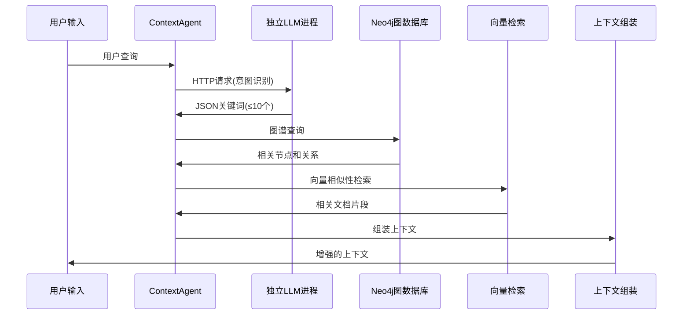

# CLAUDE.md

This file provides guidance to Claude Code (claude.ai/code) when working with code in this repository.

## 🚨 系统实现指南 - 必须参考

**重要**: 在进行任何系统级操作前，Claude 必须查阅 `SYSTEM_IMPLEMENTATION_GUIDE.md`

该文档包含：
- 每个功能模块的唯一实现路径
- 已废弃的重复实现列表  
- 正确的工具和API调用方式
- 系统架构和清理状态

**禁止使用**: 任何标记为 Legacy、refactored、guidance 的实现

## Project Overview

Gemini CLI is an advanced command-line AI workflow tool built by Jason Zhang that connects to various AI models including Gemini, OpenAI-compatible, and local models. It features a sophisticated context-aware system with separate LLM process architecture, Neo4j Graph RAG integration, and comprehensive modular logging. The project includes an OpenAI compatibility layer for third-party model providers and advanced RAG (Retrieval-Augmented Generation) capabilities.

## Architecture

### Monorepo Structure
- **`packages/cli/`** - Frontend CLI package (`@google/gemini-cli`)
  - React-based UI using Ink framework  
  - User input processing and display rendering
  - Authentication and configuration
- **`packages/core/`** - Backend package (`@google/gemini-cli-core`)
  - Gemini API client and communication
  - Tool registration and execution system
  - OpenAI compatibility adapter
  - Session management and security

### Key Systems

**Tools System**: Built-in tools include file operations (`read_file`, `write_file`, `list_directory`, `glob`, `search_file_content`, `replace`), shell execution (`run_shell_command`), web capabilities (`web_fetch`, `web_search`), memory storage (`save_memory`), and MCP server integration.

**Task Management & Maintenance Mode**: Intelligent task workflow system with mutual exclusion logic:
- **Planning Mode** (no active task list): 
  - ✅ `create_tasks` available for complex request decomposition
  - ❌ Maintenance tools (`finish_current_task`, `insert_task`, `modify_task`) disabled
  - Used for initial task breakdown and workflow planning
- **Maintenance Mode** (active task list exists):
  - ❌ `create_tasks` strictly forbidden (prevents task list duplication)
  - ✅ Maintenance tools available: `get_current_task`, `finish_current_task`, `insert_task`, `modify_task`
  - Focus on executing existing tasks, not replanning entire workflows
- **Tool Guidance Enforcement**:
  - `tool-guidance.ts` implements mode-based tool filtering
  - `promptBuilder.ts` provides mode-specific instructions
  - Unique tool guidance prevents duplication across systems
  - OpenAI mode uses unified Tool interface for consistency

**Separate LLM Process Architecture**: Revolutionary separate process system for ContextAgent intent recognition:
- `contextAgentLLMProcess.ts` - Core LLM processing logic with strict JSON response validation
- `contextAgentLLMServer.ts` - HTTP server running separate LLM process 
- `contextAgentLLMClient.ts` - Client for main process communication via HTTP IPC
- `contextAgentProcessManager.ts` - Process lifecycle management and health monitoring
- `contextAgentLLMWorker.ts` - Worker process wrapper with fault tolerance

**Neo4j Graph RAG System**: Advanced Knowledge Graph RAG implementation:
- Neo4j as default RAG provider with graph-based context retrieval
- Complete removal of text matching fallbacks (SiliconFlow provider cleaned)
- Intent recognition → JSON keywords (≤10) → RAG queries workflow
- Knowledge graph with semantic relationships and vector embeddings
- Support for multi-turn conversation history and incremental indexing

**Enhanced Modular Logging**: Comprehensive turn-based logging system:
- `enhancedLogger.ts` - Advanced logging with turn separation and module filtering
- File naming format: `content-time` (e.g., `context-turn-abc123-2025-07-18-14-30-00.jsonl`)
- Module-specific logging: context, rag, llm, embedding, vectorstore, etc.
- Environment variable configuration for each module's enable/file output
- Turn-based log separation with unique IDs and session tracking

**OpenAI Compatibility**: Complete adapter layer in `packages/core/src/openai/` provides API compatibility, tool conversion between formats, model mapping, and multi-turn conversation management. Key files:
- `adapter.ts` - Main adapter implementing GeminiClient interface
- `realClient.ts` - OpenAI API client with tool parsing
- `toolConverter.ts` - Tool format conversion and text-guided parsing
- `config.ts` - Provider configuration management

**Context Separation System**: Modular prompt building with 6 distinct sections:
- Static prompts (core instructions, project context, style guidelines)
- Dynamic prompts (session context, recent actions, user intent)
- Tool guidance (available tools and usage instructions)
- System prompts (role, capabilities, limitations, behavior)
- RAG context (graph-based retrieved context)
- LLM intent (separate process intent recognition results)

### 📋 上下文拼接与分区系统

#### 上下文分区架构
系统将所有上下文信息分为4个独立且非重叠的标准分区：

**1. 系统上下文 (System Context)**
```typescript
// packages/core/src/context/standardContextIntegrator.ts
interface SystemContext {
  workingDirectory: string;        // 当前工作目录
  timestamp: string;              // 会话时间戳
  sessionId: string;              // 唯一会话ID
  tools: string[];                // 可用工具列表
  capabilities: string[];         // 系统能力
  conversationHistory: Array<{    // 对话历史(过滤<think>标签)
    role: 'user' | 'assistant' | 'system';
    content: string;
    timestamp: string;
  }>;
}
```

**2. 静态上下文 (Static Context)**
```typescript
interface StaticContext {
  projectStructure?: string;      // 项目结构树
  dependencies?: string[];        // 依赖配置文件
  documentation?: string[];       // 项目文档
  gitStatus?: string;            // Git状态信息
  globalRules?: string[];        // 全局规则(~/.gemini/rules)
  projectRules?: string[];       // 项目规则(.gemini/rules)
  globalMemories?: string[];     // 全局记忆(~/.gemini/memories)
  projectMemories?: string[];    // 项目记忆(.gemini/memories)
}
```

**3. 动态上下文 (Dynamic Context)**
```typescript
interface DynamicContext {
  recentOperations: string[];    // 最近执行的操作记录
  errorHistory: string[];        // 错误历史记录
  userInstructions: string[];    // 用户指令摘要
}
```

**4. 任务上下文 (Task Context)**
```typescript
interface TaskContext {
  workflow?: WorkflowTemplate;   // 工作流模板信息
  currentTask?: string;          // 当前执行任务
  taskList?: Array<{            // 任务列表详情
    id: string;
    description: string;
    status: 'pending' | 'in_progress' | 'completed';
  }>;
  progress?: string;             // 任务进度(如: "3/8")
  maintenanceMode: boolean;      // 是否处于维护模式
}
```

#### 上下文拼接流程

**1. 上下文收集 (Parallel Collection)**
```typescript
// packages/core/src/context/standardContextIntegrator.ts:334
const [systemContext, staticContext, dynamicContext, taskContext] = await Promise.all([
  this.getSystemContext(),
  this.getStaticContext(includeProjectDiscovery),
  this.getDynamicContext(),
  this.getTaskContext()
]);
```

**2. 格式化拼接 (Sequential Assembly)**
```typescript
// packages/core/src/context/promptBuilder.ts:134
export async function buildPrompt(config: Config): Promise<string> {
  const sections = [];
  
  // Section 1: 基础系统提示 (Base + OpenAI适配)
  const basePrompt = await getBasePrompt(config);
  const openAIPrompt = await getOpenAIAdaptedPrompt(config, basePrompt);
  sections.push(openAIPrompt ?? basePrompt);

  // Section 2: 当前任务提示 (如果存在活跃任务)
  const taskPrompt = await getCurrentTaskPrompt();
  if (taskPrompt) sections.push(taskPrompt);

  // Section 3: 模式提示 (Planning vs Maintenance)
  const modePrompt = getModePrompt(config);
  if (modePrompt) sections.push(modePrompt);

  // Section 4: 动态上下文 (已移除 - 由contextAgent注入)
  // Dynamic context now handled entirely by contextAgent

  return sections.join('\n\n');  // 使用双换行分隔各section
}
```

**3. RAG上下文注入 (Separate Process)**
```typescript
// packages/core/src/context/contextAgent.ts
async injectContextIntoDynamicSystem(userInput: string) {
  // 1. 意图识别 (Separate LLM Process)
  const intent = await this.llmClient.recognizeIntent(userInput);
  
  // 2. RAG查询 (Neo4j Graph)
  const ragContext = await this.knowledgeGraphProvider.query(intent.keywords);
  
  // 3. 动态注入 (Runtime Injection)
  this.dynamicSystemContext = ragContext;
}
```

#### 上下文隔离保证

**1. 分区独立性**
- 每个分区有独立的数据结构和接口
- 分区之间无交叉引用或重复内容
- 通过TypeScript接口强制类型隔离

**2. 拼接顺序一致性**
```typescript
// packages/core/src/context/promptBuilder.ts:14
const PROMPT_GETTER_MAPPING = {
  base: getBasePrompt,        // 1. 基础提示
  openAI: getOpenAIAdaptedPrompt, // 2. OpenAI适配
  task: getCurrentTaskPrompt,     // 3. 任务提示  
  mode: getModePrompt,           // 4. 模式提示
  context: getDynamicContextPrompt, // 5. 动态上下文(已禁用)
}
```

**3. 内容去重机制**
- 静态上下文使用缓存避免重复加载
- 动态上下文过滤重复操作记录
- 任务上下文确保单一活跃任务状态

#### 上下文长度优化

**1. 内容裁剪策略**
```typescript
// 对话历史：最近10条，每条最多200字符
conversationHistory = existingContext.historyRecords.slice(-10).map(record => ({
  content: record.content.length > 200 ? 
           record.content.substring(0, 200) + '...' : 
           record.content
}));

// 用户指令：最近2条，每条最多100字符
recentUserMessages = records.slice(-2).map(record => 
  content.length > 100 ? content.substring(0, 100) + '...' : content
);
```

**2. 分层加载机制**
```typescript
// 轻量级上下文：基础信息
formatStandardContextForModel(context: StandardContext): string {
  // RAG content removed from system prompts - only basic context formatting
  const sections: string[] = [];
  
  // 1. 系统上下文 (minimal)
  if (context.system.sessionId) {
    sections.push(`# 📂 系统信息\n**会话ID**: ${context.system.sessionId}`);
  }
  
  // 2. 静态上下文 (minimal)  
  if (context.static.globalRules) {
    sections.push(`# 📋 项目规则\n*基本项目规则和配置*`);
  }
  
  // 3. 动态上下文移除 - 现在由contextAgent处理
  
  // 4. 任务上下文 (保留)
  if (context.task.taskList && context.task.taskList.length > 0) {
    sections.push(this.formatTaskContext(context.task));
  }
}
```

### 🧠 ContextAgent动态上下文系统

ContextAgent是系统中负责**动态上下文生成和注入**的核心模块，采用模块化设计确保单一职责和唯一实现。

#### ContextAgent架构概览

**核心组件关系图**:
```
用户输入 → ContextAgent.injectContextIntoDynamicSystem()
    ↓
意图识别 (LLM独立进程) → RAG查询 (Neo4j Graph) → 动态注入
    ↓                    ↓                     ↓
LLMClient              GraphProvider         ContextManager
    ↓                    ↓                     ↓
LLMProcess             Neo4jProvider        DynamicContext
```

#### 1. 核心流程机制 (单一入口)

**唯一入口点**: `packages/core/src/context/contextAgent.ts:328`
```typescript
// 统一的动态上下文注入接口
async injectContextIntoDynamicSystem(userInput?: string): Promise<void> {
  // 1. 输入预处理 - 过滤<think>标签
  const filteredUserInput = userInput ? this.filterThinkingContent(userInput) : userInput;
  
  // 2. 上下文生成 - 三层回退机制
  const contextOutput = await this.getContextForPrompt(filteredUserInput);
  
  // 3. 动态注入 - 清除旧上下文，注入新上下文
  const contextManager = this.config.getContextManager();
  contextManager.clearDynamicContext();
  contextManager.addDynamicContext(contextOutput);
}
```

**三层回退机制**: `packages/core/src/context/contextAgent.ts:398`
```typescript
async getContextForPrompt(userInput?: string): Promise<string> {
  const contextSections: string[] = [];

  // 第1层: RAG系统 (优先级最高)
  if (this.contextExtractor && userInput) {
    try {
      const ragResult = await this.extractContextWithRAG(userInput);
      if (ragResult) contextSections.push(ragResult);
    } catch (ragError) {
      console.warn('RAG system failed, falling back to layered context');
    }
  }

  // 第2层: 分层上下文管理器 (RAG失败时的回退)
  if (contextSections.length === 0) {
    const layeredResult = await this.layeredContextManager.generateLayeredContext(
      userInput || '', 100000 // 无限制Token预算
    );
    const formattedContext = this.layeredContextManager.formatLayeredContextForModel(layeredResult);
    if (formattedContext) contextSections.push(formattedContext);
  }
  
  // 第3层: 基本回退上下文 (确保系统健壮性)
  if (contextSections.length === 0) {
    const fallbackContext = this.generateFallbackContext(stats);
    return fallbackContext;
  }
}
```

#### 2. 独立LLM进程架构 (模块化隔离)

**进程隔离设计**: ContextAgent使用独立的Node.js进程进行意图识别，确保与主对话进程完全隔离

**LLM客户端管理**: `packages/core/src/context/contextAgentLLMClient.ts`
```typescript
export class ContextAgentLLMClient {
  private serverProcess: ChildProcess | null = null;
  private serverPort: number | null = null;
  
  // 启动独立Node.js进程
  private async startServer(): Promise<void> {
    this.serverProcess = spawn('node', [
      '-e', `
        const { ContextAgentLLMServer } = require('@google/gemini-cli-core/dist/src/context/contextAgentLLMServer.js');
        const server = new ContextAgentLLMServer();
        server.start().then(port => {
          console.log('SERVER_READY:' + port);
        });
      `
    ], {
      env: {
        CONTEXTAGENT_PROVIDER: process.env.CONTEXTAGENT_PROVIDER || 'gemini',
        CONTEXTAGENT_MODEL: process.env.CONTEXTAGENT_MODEL || 'gemini-1.5-flash',
        CONTEXTAGENT_DEBUG: this.debugMode ? '1' : '0'
      }
    });
  }
}
```

**LLM处理核心**: `packages/core/src/context/contextAgentLLMProcess.ts`
```typescript
export class ContextAgentLLMProcess {
  // 意图识别处理 (唯一实现)
  async processIntentRecognition(request: IntentRecognitionRequest): Promise<IntentRecognitionResponse> {
    // 1. 构建意图识别提示
    const intentPrompt = this.buildIntentPrompt(request.userInput);
    
    // 2. 调用LLM获取结构化响应
    const response = await this.callLLMForIntentRecognition(intentPrompt);
    
    // 3. 解析JSON响应 (严格验证)
    const result = this.parseIntentResponse(response, request.userInput);
    
    // 4. 返回结构化意图数据
    return {
      intent: result.intent,      // 用户意图描述
      keywords: result.keywords,  // 关键字列表(≤10个)
      confidence: result.confidence // 置信度(0-1)
    };
  }
}
```

#### 3. RAG系统提供者工厂 (可插拔架构)

**提供者工厂模式**: `packages/core/src/context/providers/contextProviderFactory.ts`
```typescript
export class ContextProviderFactory implements IContextProviderFactory {
  // 单例模式确保唯一实例
  private static instance: ContextProviderFactory;
  
  // 提供者注册表 (模块化注册)
  private vectorProviders = new Map<string, new (...args: any[]) => IVectorSearchProvider>();
  private extractorProviders = new Map<string, new (...args: any[]) => IContextExtractor>();
  private graphProviders = new Map<string, new (...args: any[]) => IKnowledgeGraphProvider>();

  // 默认提供者注册 (简化为Neo4j优先)
  private registerDefaultProviders(): void {
    // 唯一图数据库提供者
    this.graphProviders.set('neo4j', Neo4jKnowledgeGraphProvider);
    
    // 唯一RAG提取器
    this.extractorProviders.set('neo4j-graph-rag', Neo4jGraphRAGExtractor);
    
    // 简化向量提供者
    this.vectorProviders.set('none', NullVectorProvider);
  }
}
```

**项目大小自适应配置**:
```typescript
// packages/core/src/context/contextAgent.ts:157
private async initializeRAGSystem(): Promise<void> {
  // 根据项目大小决定提供者配置
  const stats = this.knowledgeGraph.getStatistics();
  const nodeCount = stats?.totalNodes || 0;
  const projectSize = nodeCount > 10000 ? 'large' : (nodeCount > 1000 ? 'medium' : 'small');

  // 创建推荐的提供者配置
  const providerConfig = this.providerFactory.createRecommendedSetup(projectSize);
  
  // 初始化提供者链
  this.graphProvider = this.providerFactory.createGraphProvider(providerConfig.graphProvider);
  this.vectorProvider = this.providerFactory.createVectorProvider(providerConfig.vectorProvider);
  this.contextExtractor = this.providerFactory.createContextExtractor(
    providerConfig.extractorProvider,
    this.graphProvider,
    this.vectorProvider
  );
}
```

#### 4. 知识图谱增量更新机制

**文件变更处理**: `packages/core/src/context/contextAgent.ts:986`
```typescript
async processFileChange(filePath: string, changeType: 'created' | 'modified' | 'deleted'): Promise<void> {
  // 增量更新策略
  if (changeType === 'deleted') {
    // 1. 从知识图谱中移除文件节点
    await this.knowledgeGraph.removeFileNodes(filePath);
    
    // 2. 从向量存储中移除文档
    if (this.vectorProvider) {
      await this.vectorProvider.removeDocument(filePath);
    }
  } else if (changeType === 'created' || changeType === 'modified') {
    // 1. 重新分析文件
    const analysisResult = await this.staticAnalyzer.analyzeFile(filePath);
    
    // 2. 更新知识图谱
    if (changeType === 'modified') {
      await this.knowledgeGraph.removeFileNodes(filePath); // 清除旧数据
    }
    await this.knowledgeGraph.addAnalysisResult(analysisResult.nodes, analysisResult.relations);
    
    // 3. 更新RAG系统
    if (this.vectorProvider && analysisResult.nodes.length > 0) {
      for (const node of analysisResult.nodes) {
        const content = this.extractNodeContentForRAG(node);
        if (content.trim()) {
          await this.vectorProvider.indexDocument(node.id, content, metadata);
        }
      }
    }
  }
}
```

#### 5. 上下文格式化和优化

**RAG上下文格式化**: `packages/core/src/context/contextAgent.ts:810`
```typescript
private formatRAGContextForModel(context: any, intentAnalysis?: {...}): string {
  const sections: string[] = [];

  // 1. LLM意图分析结果
  if (intentAnalysis) {
    sections.push('## 🎯 LLM Intent Recognition');
    sections.push(`**Intent**: ${intentAnalysis.intent}`);
    sections.push(`**Keywords**: ${intentAnalysis.keywords.join(', ')}`);
    sections.push(`**Confidence**: ${(intentAnalysis.confidence * 100).toFixed(1)}%`);
  }

  // 2. 语义分析结果
  if (context.semantic) {
    sections.push('## 🎯 Semantic Analysis');
    sections.push(`**Intent**: ${context.semantic.intent}`);
    sections.push(`**Entities**: ${context.semantic.entities.join(', ')}`);
  }

  // 3. 代码上下文（包含文件内容和行号）
  if (context.code?.relevantFiles.length > 0) {
    sections.push('## 📁 Relevant Files');
    context.code.relevantFiles.forEach((file: any) => {
      sections.push(`- **${file.path}**: ${file.summary} (relevance: ${(file.relevance * 100).toFixed(0)}%)`);
      
      // 添加文件内容上下文
      if (file.contextLines && file.contextLines.length > 0) {
        sections.push('**📄 File Content Context**:');
        sections.push('```');
        file.contextLines.forEach((line: string, index: number) => {
          const lineNumber = (file.startLine || 1) + index;
          const marker = index === file.matchedLineIndex ? '→' : ' ';
          sections.push(`${lineNumber.toString().padStart(4)}${marker}${line}`);
        });
        sections.push('```');
      }
    });
  }

  return sections.join('\n');
}
```

#### 6. 模块化保证和唯一性

**单例模式确保唯一性**:
- `ContextProviderFactory` - 单例工厂，全局唯一
- `ContextAgent` - 每个Config实例一个，确保会话隔离
- `LLMClient` - 独立进程管理，确保进程隔离

**接口隔离确保模块化**:
- `IContextExtractor` - 上下文提取接口
- `IVectorSearchProvider` - 向量搜索接口
- `IKnowledgeGraphProvider` - 知识图谱接口

**依赖注入确保可测试性**:
```typescript
// 构造函数注入，便于单元测试
this.contextExtractor = this.providerFactory.createContextExtractor(
  providerConfig.extractorProvider,
  this.graphProvider,      // 图提供者依赖
  this.vectorProvider      // 向量提供者依赖
);
```

#### 7. 调试和监控

**分模块调试支持**:
```bash
# ContextAgent模块调试
DEBUG_CONTEXT=true DEBUG_CONTEXT_FILE=true gemini --debug

# RAG系统调试
DEBUG_RAG=true DEBUG_RAG_FILE=true gemini --debug

# LLM进程调试
DEBUG_LLM=true CONTEXTAGENT_DEBUG=true gemini --debug

# 查看ContextAgent日志
tail -f ~/.gemini/debug/context-turn-*-*.jsonl
tail -f ~/.gemini/debug/rag-turn-*-*.jsonl
tail -f ~/.gemini/debug/llm-turn-*-*.jsonl
```

**性能监控**:
```typescript
// 各阶段性能追踪
const startTime = Date.now();
const ragResult = await this.extractContextWithRAG(userInput);
const duration = Date.now() - startTime;

console.log(`[ContextAgent] RAG extraction completed in ${duration}ms`);
```

### 🔄 ContextAgent与ContextManager协作机制

#### 问题分析：上下文注入冲突

**当前冲突点**:
1. **ContextAgent** 通过 `injectContextIntoDynamicSystem()` 调用 `contextManager.addDynamicContext()`
2. **ContextManager** 通过 `addDynamicContext()` 直接添加到 `context.dynamicContext[]`
3. **潜在冲突**: 两个系统都在操作同一个动态上下文存储

**协作关系设计**:
```
用户输入 → ContextAgent → ContextManager → DynamicContext Storage
   ↓           ↓              ↓              ↓
意图识别    上下文生成      存储管理       统一格式化
```

#### 解决方案：明确职责分离

**1. ContextAgent - 上下文生成者 (Producer)**
```typescript
// packages/core/src/context/contextAgent.ts:328
async injectContextIntoDynamicSystem(userInput?: string): Promise<void> {
  // 职责：生成智能上下文内容
  const contextOutput = await this.getContextForPrompt(filteredUserInput);
  
  // 委托给ContextManager进行存储管理
  const contextManager = this.config.getContextManager();
  contextManager.clearDynamicContext();  // 清除旧上下文
  contextManager.addDynamicContext(contextOutput);  // 添加新上下文
}
```

**2. ContextManager - 上下文管理者 (Manager)**
```typescript
// packages/core/src/context/contextManager.ts:270
addDynamicContext(context: string): void {
  // 职责：统一管理动态上下文存储
  this.context.dynamicContext.push(context);
}

clearDynamicContext(): void {
  // 职责：清理动态上下文
  this.context.dynamicContext = [];
}
```

**3. 消除冲突的设计原则**:
- **单一写入源**: 只有 ContextAgent 负责生成动态上下文内容
- **统一存储接口**: 只有 ContextManager 负责动态上下文的存储操作
- **清晰的数据流**: `用户输入 → ContextAgent处理 → ContextManager存储 → 模型消费`

#### 正确设计：会话上下文感知 (非索引修改)

**重要修正**: 图谱和RAG索引是静态字典，不应在查询过程中修改。正确的做法是维护**会话级别的上下文状态**。

**1. 失败指引记录系统**:
```typescript
// packages/core/src/context/contextAgent.ts (专注失败记录)
export class ContextAgent {
  // 失败历史记录 (本地存储)
  private failureHistory = new Map<string, FailureRecord[]>();
  
  /**
   * 处理工具调用失败 - 记录失败指引
   */
  async recordToolCallFailure(toolCall: ToolCallInfo, error: string, context: string): Promise<void> {
    try {
      const failureRecord: FailureRecord = {
        id: `failure-${Date.now()}`,
        timestamp: new Date().toISOString(),
        toolName: toolCall.name,
        args: toolCall.args,
        errorMessage: error,
        context: context,
        userInput: this.getCurrentUserInput(),
        sessionId: this.sessionId
      };

      // 1. 记录到内存
      const key = `${toolCall.name}:${JSON.stringify(toolCall.args)}`;
      if (!this.failureHistory.has(key)) {
        this.failureHistory.set(key, []);
      }
      this.failureHistory.get(key)!.push(failureRecord);

      // 2. 持久化到本地文件
      await this.saveFailureRecord(failureRecord);

      if (this.config.getDebugMode()) {
        console.log(`[ContextAgent] Recorded tool failure: ${toolCall.name}`);
      }

    } catch (recordError) {
      console.error('[ContextAgent] Failed to record tool failure:', recordError);
    }
  }

  /**
   * 记录方案尝试失败
   */
  async recordApproachFailure(approach: string, reason: string, context: string): Promise<void> {
    try {
      const failureRecord: ApproachFailureRecord = {
        id: `approach-failure-${Date.now()}`,
        timestamp: new Date().toISOString(),
        approach: approach,
        failureReason: reason,
        context: context,
        userInput: this.getCurrentUserInput(),
        sessionId: this.sessionId
      };

      // 持久化方案失败记录
      await this.saveApproachFailure(failureRecord);

      if (this.config.getDebugMode()) {
        console.log(`[ContextAgent] Recorded approach failure: ${approach}`);
      }

    } catch (recordError) {
      console.error('[ContextAgent] Failed to record approach failure:', recordError);
    }
  }

  /**
   * 本地失败记录存储 (简单实现)
   */
  private async saveFailureRecord(record: FailureRecord): Promise<void> {
    const failureDir = path.join(this.projectDir, '.gemini', 'failures');
    await fs.promises.mkdir(failureDir, { recursive: true });
    
    const fileName = `tool-failures-${new Date().toISOString().split('T')[0]}.jsonl`;
    const filePath = path.join(failureDir, fileName);
    
    const logLine = JSON.stringify(record) + '\n';
    await fs.promises.appendFile(filePath, logLine, 'utf8');
  }

  private async saveApproachFailure(record: ApproachFailureRecord): Promise<void> {
    const failureDir = path.join(this.projectDir, '.gemini', 'failures');
    await fs.promises.mkdir(failureDir, { recursive: true });
    
    const fileName = `approach-failures-${new Date().toISOString().split('T')[0]}.jsonl`;
    const filePath = path.join(failureDir, fileName);
    
    const logLine = JSON.stringify(record) + '\n';
    await fs.promises.appendFile(filePath, logLine, 'utf8');
  }

  /**
   * 动态注入失败指引到上下文
   */
  async injectFailureGuidance(userInput: string): Promise<string> {
    const guidanceSections: string[] = [];

    // 1. 查找相关的工具失败记录
    const relevantToolFailures = await this.findRelevantToolFailures(userInput);
    if (relevantToolFailures.length > 0) {
      guidanceSections.push(this.formatToolFailureGuidance(relevantToolFailures));
    }

    // 2. 查找相关的方案失败记录
    const relevantApproachFailures = await this.findRelevantApproachFailures(userInput);
    if (relevantApproachFailures.length > 0) {
      guidanceSections.push(this.formatApproachFailureGuidance(relevantApproachFailures));
    }

    return guidanceSections.length > 0 
      ? `# ⚠️ 失败指引 (Failure Guidance)\n*基于历史失败记录的避坑指南*\n\n${guidanceSections.join('\n\n')}`
      : '';
  }

  /**
   * 格式化工具失败指引
   */
  private formatToolFailureGuidance(failures: FailureRecord[]): string {
    const sections = ['## 🔧 工具调用失败记录'];
    
    for (const failure of failures.slice(-3)) { // 最近3个失败
      sections.push(`### ${failure.toolName} 失败案例`);
      sections.push(`**时间**: ${failure.timestamp}`);
      sections.push(`**参数**: \`${JSON.stringify(failure.args)}\``);
      sections.push(`**错误**: ${failure.errorMessage}`);
      sections.push(`**上下文**: ${failure.context}`);
      sections.push('');
    }
    
    return sections.join('\n');
  }

  /**
   * 格式化方案失败指引
   */
  private formatApproachFailureGuidance(failures: ApproachFailureRecord[]): string {
    const sections = ['## 💡 方案尝试失败记录'];
    
    for (const failure of failures.slice(-3)) { // 最近3个失败
      sections.push(`### ${failure.approach} 失败案例`);
      sections.push(`**时间**: ${failure.timestamp}`);
      sections.push(`**失败原因**: ${failure.failureReason}`);
      sections.push(`**上下文**: ${failure.context}`);
      sections.push('');
    }
    
    return sections.join('\n');
  }

  /**
   * 查找相关的工具失败记录 (简单关键字匹配)
   */
  private async findRelevantToolFailures(userInput: string): Promise<FailureRecord[]> {
    const relevantFailures: FailureRecord[] = [];
    const keywords = this.extractKeywords(userInput);
    
    // 从本地文件读取失败记录
    const failureDir = path.join(this.projectDir, '.gemini', 'failures');
    try {
      const files = await fs.promises.readdir(failureDir);
      const toolFailureFiles = files.filter(f => f.startsWith('tool-failures-'));
      
      for (const file of toolFailureFiles.slice(-7)) { // 最近7天
        const content = await fs.promises.readFile(path.join(failureDir, file), 'utf8');
        const lines = content.trim().split('\n').filter(Boolean);
        
        for (const line of lines) {
          try {
            const record: FailureRecord = JSON.parse(line);
            
            // 简单匹配：工具名或参数包含关键字
            const isRelevant = keywords.some(keyword => 
              record.toolName.toLowerCase().includes(keyword.toLowerCase()) ||
              JSON.stringify(record.args).toLowerCase().includes(keyword.toLowerCase()) ||
              record.context.toLowerCase().includes(keyword.toLowerCase())
            );
            
            if (isRelevant) {
              relevantFailures.push(record);
            }
          } catch (parseError) {
            // 忽略解析错误的行
          }
        }
      }
    } catch (error) {
      // 没有失败记录文件，返回空数组
    }
    
    return relevantFailures.slice(-5); // 最多返回5个相关失败
  }

  /**
   * 查找相关的方案失败记录
   */
  private async findRelevantApproachFailures(userInput: string): Promise<ApproachFailureRecord[]> {
    const relevantFailures: ApproachFailureRecord[] = [];
    const keywords = this.extractKeywords(userInput);
    
    const failureDir = path.join(this.projectDir, '.gemini', 'failures');
    try {
      const files = await fs.promises.readdir(failureDir);
      const approachFailureFiles = files.filter(f => f.startsWith('approach-failures-'));
      
      for (const file of approachFailureFiles.slice(-7)) { // 最近7天
        const content = await fs.promises.readFile(path.join(failureDir, file), 'utf8');
        const lines = content.trim().split('\n').filter(Boolean);
        
        for (const line of lines) {
          try {
            const record: ApproachFailureRecord = JSON.parse(line);
            
            const isRelevant = keywords.some(keyword => 
              record.approach.toLowerCase().includes(keyword.toLowerCase()) ||
              record.failureReason.toLowerCase().includes(keyword.toLowerCase()) ||
              record.context.toLowerCase().includes(keyword.toLowerCase())
            );
            
            if (isRelevant) {
              relevantFailures.push(record);
            }
          } catch (parseError) {
            // 忽略解析错误的行
          }
        }
      }
    } catch (error) {
      // 没有失败记录文件，返回空数组
    }
    
    return relevantFailures.slice(-3); // 最多返回3个相关失败
  }
}
```

**2. 数据结构定义**:
```typescript
// packages/core/src/context/types.ts (新增类型定义)
export interface FailureRecord {
  id: string;
  timestamp: string;
  toolName: string;
  args: Record<string, any>;
  errorMessage: string;
  context: string;           // 执行时的上下文描述
  userInput: string;         // 导致失败的用户输入
  sessionId: string;
}

export interface ApproachFailureRecord {
  id: string;
  timestamp: string;
  approach: string;          // 尝试的方案描述
  failureReason: string;     // 失败原因
  context: string;           // 尝试时的上下文
  userInput: string;         // 用户的原始需求
  sessionId: string;
}

export interface ToolCallInfo {
  name: string;
  args: Record<string, any>;
  callId?: string;
}
```

**3. 集成到上下文生成流程**:
```typescript
// packages/core/src/context/contextAgent.ts (修改现有方法)
async getContextForPrompt(userInput?: string): Promise<string> {
  const contextSections: string[] = [];

  // 1. 基础RAG查询 (静态索引)
  if (this.contextExtractor && userInput) {
    try {
      const ragResult = await this.extractContextWithRAG(userInput);
      if (ragResult) contextSections.push(ragResult);
    } catch (ragError) {
      console.warn('RAG system failed, falling back to layered context');
    }
  }

  // 2. 失败指引注入 (动态历史)
  if (userInput) {
    try {
      const failureGuidance = await this.injectFailureGuidance(userInput);
      if (failureGuidance) {
        contextSections.push(failureGuidance);
      }
    } catch (guidanceError) {
      console.warn('Failure guidance injection failed:', guidanceError);
    }
  }

  // 3. 分层上下文回退
  if (contextSections.length === 0) {
    const layeredResult = await this.layeredContextManager.generateLayeredContext(
      userInput || '', 100000
    );
    const formattedContext = this.layeredContextManager.formatLayeredContextForModel(layeredResult);
    if (formattedContext) contextSections.push(formattedContext);
  }

  return contextSections.join('\n\n---\n\n');
}
```

**4. 工具执行失败拦截**:
```typescript
// packages/core/src/tools/tools.ts (在工具执行基类中添加)
export abstract class BaseTool<TParams, TResult> {
  async executeWithFailureTracking(params: TParams, context: string): Promise<TResult> {
    try {
      return await this.execute(params);
    } catch (error) {
      // 记录工具调用失败
      const contextAgent = this.config?.getContextAgent();
      if (contextAgent) {
        await contextAgent.recordToolCallFailure(
          { name: this.name, args: params as any },
          error instanceof Error ? error.message : String(error),
          context
        );
      }
      throw error; // 重新抛出错误
    }
  }
}
```

**5. 文件存储结构**:
```
.gemini/failures/
├── tool-failures-2025-01-15.jsonl     # 工具失败记录
├── tool-failures-2025-01-16.jsonl
├── approach-failures-2025-01-15.jsonl # 方案失败记录
└── approach-failures-2025-01-16.jsonl
```

**6. 使用示例**:
```typescript
// 工具失败自动记录
const contextAgent = config.getContextAgent();

// 在工具执行失败时自动调用
await contextAgent.recordToolCallFailure(
  { name: 'write_file', args: { file_path: './test.js', content: '...' } },
  'Permission denied: cannot write to read-only file',
  '用户尝试修改只读文件 ./test.js'
);

// 方案失败手动记录 (在复杂逻辑中)
await contextAgent.recordApproachFailure(
  '使用正则表达式解析复杂JSON',
  '正则表达式无法处理嵌套结构和转义字符',
  '用户要求解析包含嵌套对象的JSON字符串'
);
```

**集成优势**:
- **轻量级实现**: 简单的JSONL文件存储，无需复杂数据库
- **自动收集**: 工具失败自动记录，无需手动干预
- **智能匹配**: 基于关键字的简单但有效的相关性匹配
- **避坑指南**: 为模型提供历史失败案例，避免重复同样的错误
- **渐进式学习**: 随着使用时间增长，失败指引越来越丰富

### 💬 会话历史RAG系统

#### 设计理念：对话历史作为文本RAG资源

**核心思路**: 将用户和模型的对话历史保存为独立的文本文档，使用文本RAG技术进行关键字检索，让ContextAgent能够检索到相关的历史对话上下文。

#### 1. 会话历史存储结构

**会话记录格式**:
```typescript
// packages/core/src/context/conversationRAG.ts (新增文件)
export interface ConversationRecord {
  id: string;
  timestamp: string;
  sessionId: string;
  turnId: number;
  
  // 对话内容
  userInput: string;         // 用户输入 (原始)
  modelResponse: string;     // 模型响应 (清理后)
  
  // 上下文信息
  toolCalls: ToolCallSummary[];  // 工具调用摘要
  taskContext: string;           // 任务上下文
  outcome: 'success' | 'failure' | 'partial'; // 对话结果
  
  // 检索增强
  keywords: string[];        // 提取的关键字
  summary: string;          // 对话摘要 (用于检索)
  topics: string[];         // 主题标签
}

export interface ToolCallSummary {
  name: string;
  success: boolean;
  brief: string;            // 工具调用简要描述
}
```

**文件存储结构**:
```
.gemini/conversations/
├── conversation-2025-01-15.jsonl    # 每日对话记录
├── conversation-2025-01-16.jsonl
└── index/
    ├── keywords.index               # 关键字索引
    ├── topics.index                # 主题索引
    └── summary.index               # 摘要索引
```

#### 2. 会话RAG核心实现

```typescript
// packages/core/src/context/conversationRAG.ts
export class ConversationRAGSystem {
  private projectDir: string;
  private vectorProvider: IVectorSearchProvider | null = null;
  private debugMode: boolean;

  constructor(projectDir: string, vectorProvider?: IVectorSearchProvider, debugMode = false) {
    this.projectDir = projectDir;
    this.vectorProvider = vectorProvider;
    this.debugMode = debugMode;
  }

  /**
   * 保存对话记录并建立索引
   */
  async saveConversation(record: ConversationRecord): Promise<void> {
    try {
      // 1. 保存到JSONL文件
      await this.appendToConversationFile(record);
      
      // 2. 建立文本索引 (如果有向量提供者)
      if (this.vectorProvider) {
        await this.indexConversation(record);
      }
      
      // 3. 更新简单关键字索引
      await this.updateKeywordIndex(record);
      
      if (this.debugMode) {
        console.log(`[ConversationRAG] Saved conversation ${record.id}`);
      }

    } catch (error) {
      console.error('[ConversationRAG] Failed to save conversation:', error);
    }
  }

  /**
   * 搜索相关的历史对话
   */
  async searchRelevantConversations(query: string, limit = 5): Promise<ConversationRecord[]> {
    const results: ConversationRecord[] = [];

    try {
      // 1. 向量搜索 (如果可用)
      if (this.vectorProvider) {
        const vectorResults = await this.vectorSearchConversations(query, limit);
        results.push(...vectorResults);
      }
      
      // 2. 关键字回退搜索
      if (results.length === 0) {
        const keywordResults = await this.keywordSearchConversations(query, limit);
        results.push(...keywordResults);
      }

    } catch (error) {
      console.error('[ConversationRAG] Search failed:', error);
    }

    return results.slice(0, limit);
  }

  /**
   * 向量搜索对话历史
   */
  private async vectorSearchConversations(query: string, limit: number): Promise<ConversationRecord[]> {
    if (!this.vectorProvider) return [];

    try {
      // 搜索向量存储中的对话记录
      const searchResults = await this.vectorProvider.search(query, {
        topK: limit,
        filter: { type: 'conversation' }
      });

      const conversations: ConversationRecord[] = [];
      for (const result of searchResults) {
        const record = await this.getConversationById(result.id);
        if (record) {
          conversations.push(record);
        }
      }

      return conversations;

    } catch (error) {
      console.error('[ConversationRAG] Vector search failed:', error);
      return [];
    }
  }

  /**
   * 关键字搜索对话历史 (回退方案)
   */
  private async keywordSearchConversations(query: string, limit: number): Promise<ConversationRecord[]> {
    const conversations: ConversationRecord[] = [];
    const keywords = this.extractKeywords(query);

    try {
      // 读取最近7天的对话文件
      const conversationDir = path.join(this.projectDir, '.gemini', 'conversations');
      const files = await fs.promises.readdir(conversationDir);
      const recentFiles = files
        .filter(f => f.startsWith('conversation-') && f.endsWith('.jsonl'))
        .sort()
        .slice(-7); // 最近7天

      for (const file of recentFiles) {
        const filePath = path.join(conversationDir, file);
        const content = await fs.promises.readFile(filePath, 'utf8');
        const lines = content.trim().split('\n').filter(Boolean);

        for (const line of lines) {
          try {
            const record: ConversationRecord = JSON.parse(line);
            
            // 关键字匹配
            const isRelevant = keywords.some(keyword => 
              record.keywords.some(k => k.toLowerCase().includes(keyword.toLowerCase())) ||
              record.summary.toLowerCase().includes(keyword.toLowerCase()) ||
              record.userInput.toLowerCase().includes(keyword.toLowerCase())
            );

            if (isRelevant) {
              conversations.push(record);
            }
          } catch (parseError) {
            // 忽略解析错误的行
          }
        }
      }

    } catch (error) {
      console.error('[ConversationRAG] Keyword search failed:', error);
    }

    return conversations
      .sort((a, b) => new Date(b.timestamp).getTime() - new Date(a.timestamp).getTime())
      .slice(0, limit);
  }

  /**
   * 建立对话的向量索引
   */
  private async indexConversation(record: ConversationRecord): Promise<void> {
    if (!this.vectorProvider) return;

    try {
      // 构建用于索引的文本内容
      const indexContent = this.buildIndexContent(record);
      
      // 建立向量索引
      await this.vectorProvider.indexDocument(
        record.id,
        indexContent,
        {
          type: 'conversation',
          sessionId: record.sessionId,
          timestamp: record.timestamp,
          outcome: record.outcome,
          topics: record.topics,
          keywords: record.keywords
        }
      );

    } catch (error) {
      console.error('[ConversationRAG] Failed to index conversation:', error);
    }
  }

  /**
   * 构建用于索引的文本内容
   */
  private buildIndexContent(record: ConversationRecord): string {
    const sections: string[] = [];

    // 1. 用户输入
    sections.push(`用户: ${record.userInput}`);

    // 2. 模型响应摘要
    sections.push(`助手: ${record.summary}`);

    // 3. 工具调用情况
    if (record.toolCalls.length > 0) {
      const toolSummary = record.toolCalls.map(tc => 
        `${tc.name}(${tc.success ? '成功' : '失败'}): ${tc.brief}`
      ).join('; ');
      sections.push(`工具: ${toolSummary}`);
    }

    // 4. 任务上下文
    if (record.taskContext) {
      sections.push(`任务: ${record.taskContext}`);
    }

    // 5. 主题和关键字
    sections.push(`主题: ${record.topics.join(', ')}`);
    sections.push(`关键字: ${record.keywords.join(', ')}`);

    return sections.join('\n');
  }

  /**
   * 格式化检索到的对话历史
   */
  formatConversationHistory(conversations: ConversationRecord[]): string {
    if (conversations.length === 0) return '';

    const sections: string[] = [];
    sections.push('# 📜 相关对话历史 (Conversation History)');
    sections.push('*基于关键字检索的相关历史对话*\n');

    for (const conv of conversations) {
      sections.push(`## 对话 ${conv.turnId} - ${conv.timestamp.split('T')[0]}`);
      sections.push(`**用户**: ${this.truncateText(conv.userInput, 200)}`);
      sections.push(`**助手**: ${this.truncateText(conv.summary, 300)}`);
      
      if (conv.toolCalls.length > 0) {
        const toolsUsed = conv.toolCalls.map(tc => tc.name).join(', ');
        sections.push(`**工具**: ${toolsUsed}`);
      }
      
      sections.push(`**结果**: ${conv.outcome}`);
      sections.push('');
    }

    return sections.join('\n');
  }

  /**
   * 截断文本
   */
  private truncateText(text: string, maxLength: number): string {
    return text.length > maxLength 
      ? text.substring(0, maxLength) + '...' 
      : text;
  }

  /**
   * 提取关键字
   */
  private extractKeywords(text: string): string[] {
    // 简单的关键字提取 (可以后续优化)
    const words = text.toLowerCase()
      .replace(/[^\w\s]/g, ' ')
      .split(/\s+/)
      .filter(word => word.length >= 3);
    
    return [...new Set(words)];
  }
}
```

#### 3. 集成到ContextAgent

```typescript
// packages/core/src/context/contextAgent.ts (修改现有实现)
export class ContextAgent {
  private conversationRAG: ConversationRAGSystem;

  constructor(options: ContextAgentOptions) {
    // ... 现有初始化代码 ...
    
    // 初始化会话RAG系统
    this.conversationRAG = new ConversationRAGSystem(
      this.projectDir,
      this.vectorProvider, // 复用现有的向量提供者
      this.config.getDebugMode()
    );
  }

  /**
   * 增强的上下文获取 - 包含对话历史检索
   */
  async getContextForPrompt(userInput?: string): Promise<string> {
    const contextSections: string[] = [];

    // 1. 基础RAG查询 (静态代码索引)
    if (this.contextExtractor && userInput) {
      try {
        const ragResult = await this.extractContextWithRAG(userInput);
        if (ragResult) contextSections.push(ragResult);
      } catch (ragError) {
        console.warn('Static RAG failed, continuing with other sources');
      }
    }

    // 2. 对话历史检索 (动态会话RAG)
    if (userInput) {
      try {
        const relevantConversations = await this.conversationRAG.searchRelevantConversations(userInput, 3);
        if (relevantConversations.length > 0) {
          const conversationContext = this.conversationRAG.formatConversationHistory(relevantConversations);
          contextSections.push(conversationContext);
        }
      } catch (historyError) {
        console.warn('Conversation history retrieval failed:', historyError);
      }
    }

    // 3. 失败指引注入
    if (userInput) {
      try {
        const failureGuidance = await this.injectFailureGuidance(userInput);
        if (failureGuidance) contextSections.push(failureGuidance);
      } catch (guidanceError) {
        console.warn('Failure guidance injection failed:', guidanceError);
      }
    }

    // 4. 分层上下文回退
    if (contextSections.length === 0) {
      const layeredResult = await this.layeredContextManager.generateLayeredContext(
        userInput || '', 100000
      );
      const formattedContext = this.layeredContextManager.formatLayeredContextForModel(layeredResult);
      if (formattedContext) contextSections.push(formattedContext);
    }

    return contextSections.join('\n\n---\n\n');
  }

  /**
   * 记录对话历史 (在对话完成后调用)
   */
  async recordConversation(
    userInput: string, 
    modelResponse: string, 
    toolCalls: ToolCallSummary[] = [],
    taskContext = '',
    outcome: 'success' | 'failure' | 'partial' = 'success'
  ): Promise<void> {
    try {
      // 分析和处理对话内容
      const keywords = this.extractKeywords(userInput + ' ' + modelResponse);
      const summary = await this.generateConversationSummary(userInput, modelResponse);
      const topics = await this.extractTopics(userInput, modelResponse);

      const record: ConversationRecord = {
        id: `conv-${this.sessionId}-${Date.now()}`,
        timestamp: new Date().toISOString(),
        sessionId: this.sessionId,
        turnId: this.getCurrentTurnId(),
        userInput: userInput,
        modelResponse: this.cleanModelResponse(modelResponse),
        toolCalls: toolCalls,
        taskContext: taskContext,
        outcome: outcome,
        keywords: keywords,
        summary: summary,
        topics: topics
      };

      await this.conversationRAG.saveConversation(record);

    } catch (error) {
      console.error('[ContextAgent] Failed to record conversation:', error);
    }
  }

  /**
   * 生成对话摘要
   */
  private async generateConversationSummary(userInput: string, modelResponse: string): Promise<string> {
    // 简单实现：截取模型响应的关键部分
    const cleanResponse = this.cleanModelResponse(modelResponse);
    
    // 提取第一段有意义的内容作为摘要
    const sentences = cleanResponse.split(/[.!?]+/).filter(s => s.trim().length > 10);
    const summary = sentences.slice(0, 2).join('. ').trim();
    
    return summary.length > 300 ? summary.substring(0, 300) + '...' : summary;
  }

  /**
   * 清理模型响应 (移除思考标签、工具调用等)
   */
  private cleanModelResponse(response: string): string {
    return response
      .replace(/<think>[\s\S]*?<\/think>/g, '')     // 移除思考标签
      .replace(/\[tool_call:.*?\]/g, '')            // 移除工具调用
      .replace(/```[\s\S]*?```/g, '[代码块]')         // 替换代码块
      .trim();
  }
}
```

#### 4. 存储和索引优化

**文件存储优势**:
- **简单可靠**: JSONL格式，易于读写和备份
- **增量更新**: 新对话追加到文件末尾
- **时间分片**: 按日期分割文件，便于管理和查询

**索引策略**:
- **向量索引**: 使用现有向量提供者建立语义索引
- **关键字索引**: 简单文本匹配作为回退方案
- **主题索引**: 基于主题标签的快速过滤

这样设计确保了ContextAgent能够通过关键字查询**一定能检索到**相关的对话历史，实现真正的对话上下文连续性和智能回忆能力。

  /**
   * 增强RAG查询 - 使用静态索引和失败指引
  private async enhanceRAGQueryWithSession(userInput: string, baseKeywords: string[]): Promise<string[]> {
    const enhancedKeywords = [...baseKeywords];

    // 1. 添加最近提到的相关实体
    for (const entity of this.sessionContext.mentionedEntities) {
      if (userInput.toLowerCase().includes(entity.toLowerCase())) {
        enhancedKeywords.push(entity);
      }
    }

    // 2. 基于主题发展添加相关概念
    const recentTopics = this.sessionContext.topicProgression.slice(-5);
    for (const topic of recentTopics) {
      if (this.isTopicRelevant(topic, userInput)) {
        enhancedKeywords.push(topic);
      }
    }

    // 3. 基于用户目标添加上下文
    for (const goal of this.sessionContext.userGoals) {
      if (this.isGoalRelevant(goal, userInput)) {
        const relatedKeywords = this.extractKeywordsFromGoal(goal);
        enhancedKeywords.push(...relatedKeywords);
      }
    }

    // 去重并限制数量
    return [...new Set(enhancedKeywords)].slice(0, 15);
  }

  /**
   * 获取会话感知的上下文 (替代原来的RAG查询)
   */
  private async getSessionAwareContext(userInput: string): Promise<string> {
    const sections: string[] = [];

    // 1. 基础RAG查询 (使用静态索引)
    const baseContext = await this.extractContextWithRAG(userInput);
    if (baseContext) {
      sections.push(baseContext);
    }

    // 2. 会话上下文增强
    const sessionContext = this.formatSessionContext();
    if (sessionContext) {
      sections.push(sessionContext);
    }

    return sections.join('\n\n---\n\n');
  }

  /**
   * 格式化会话上下文为模型可读内容
   */
  private formatSessionContext(): string {
    const sections: string[] = [];

    // 添加会话状态信息
    sections.push('# 🎯 会话上下文 (Session Context)');
    sections.push('*来源: 当前会话的动态分析*\n');

    // 1. 主题发展轨迹
    if (this.sessionContext.topicProgression.length > 0) {
      const recentTopics = this.sessionContext.topicProgression.slice(-5);
      sections.push('## 📈 对话主题发展');
      sections.push(`**轨迹**: ${recentTopics.join(' → ')}`);
      sections.push('');
    }

    // 2. 用户目标理解
    if (this.sessionContext.userGoals.length > 0) {
      sections.push('## 🎯 推断的用户目标');
      for (const goal of this.sessionContext.userGoals.slice(-3)) {
        sections.push(`- ${goal}`);
      }
      sections.push('');
    }

    // 3. 最近提到的代码实体
    if (this.sessionContext.codeReferences.size > 0) {
      sections.push('## 💻 会话中的代码实体');
      const recentRefs = Array.from(this.sessionContext.codeReferences.entries()).slice(-5);
      for (const [name, info] of recentRefs) {
        sections.push(`- **${name}**: ${info.filePath} (置信度: ${(info.confidence * 100).toFixed(0)}%)`);
      }
      sections.push('');
    }

    return sections.length > 1 ? sections.join('\n') : '';
  }
}
```

**2. 静态索引更新规则**:
```typescript
// packages/core/src/context/contextAgent.ts (索引更新策略)
export class ContextAgent {
  /**
   * 文件变更时更新静态索引 (唯一正确的索引更新方式)
   */
  async processFileChange(filePath: string, changeType: 'created' | 'modified' | 'deleted'): Promise<void> {
    // ✅ 正确：只在源文件变更时更新索引
    if (changeType === 'deleted') {
      await this.knowledgeGraph.removeFileNodes(filePath);
      if (this.vectorProvider) {
        await this.vectorProvider.removeDocument(filePath);
      }
    } else if (changeType === 'created' || changeType === 'modified') {
      const analysisResult = await this.staticAnalyzer.analyzeFile(filePath);
      await this.knowledgeGraph.addAnalysisResult(analysisResult.nodes, analysisResult.relations);
      
      if (this.vectorProvider) {
        for (const node of analysisResult.nodes) {
          const content = this.extractNodeContentForRAG(node);
          await this.vectorProvider.indexDocument(node.id, content, metadata);
        }
      }
    }
  }

  /**
   * 强制重建索引 (手动触发)
   */
  async rebuildIndices(): Promise<void> {
    // ✅ 正确：重新扫描所有源文件重建索引
    await this.initialize(true); // forceFullScan = true
  }
}
```

#### 正确的架构边界

**1. 静态知识索引** (Knowledge Graph + RAG):
- **来源**: 源代码文件、项目文档、配置文件
- **更新时机**: 文件创建/修改/删除时
- **特点**: 持久化存储，静态字典

**2. 动态会话上下文** (Session Context):
- **来源**: 用户输入分析、模型响应分析
- **更新时机**: 每次对话交互
- **特点**: 内存存储，会话级别

**3. 查询增强机制**:
```typescript
// 正确的查询流程
async getContextForPrompt(userInput: string): Promise<string> {
  // 1. 基于静态索引的RAG查询 (只读)
  const staticContext = await this.queryStaticRAG(userInput);
  
  // 2. 基于会话状态的上下文增强 (只读)
  const sessionContext = this.formatSessionContext();
  
  // 3. 合并上下文 (不修改任何索引)
  return this.combineContexts(staticContext, sessionContext);
}
```

#### 总体架构优化

**正确的上下文生命周期**:
```
1. 源文件变更  → 更新静态索引 (Knowledge Graph + RAG)
2. 用户输入   → 查询静态索引 + 会话上下文 (只读)
3. 模型处理   → Gemini/OpenAI API
4. 模型响应   → 更新会话状态 (内存，非持久化)
5. 下次查询   → 增强的会话上下文 + 不变的静态索引
```

**关键原则**:
- **静态索引不可变**: 只有源文件变更才能修改
- **会话状态临时**: 内存存储，会话结束即清除  
- **查询过程只读**: 不产生任何写入操作
- **职责清晰分离**: 索引管理 vs 会话管理 vs 查询处理

#### 调试与监控

**1. 上下文调试日志**
```bash
# 启用上下文模块调试
DEBUG_CONTEXT=true DEBUG_CONTEXT_FILE=true gemini --debug

# 查看上下文拼接日志
tail -f ~/.gemini/debug/context-turn-*-*.jsonl
```

**2. 分区内容验证**
- 每个分区都有独立的格式化函数
- 调试模式下输出各分区大小和内容摘要
- 上下文拼接完成后记录总长度和分区统计

## 🏗️ 系统架构与流程

### 🔄 双模式架构

Gemini CLI 运行在两种模式下，每种模式有不同的工具和上下文处理流程：

```
用户输入 → 模式判断 → { Gemini模式 | OpenAI模式 } → 工具执行 → 结果输出
```

### 🔧 工具系统结构

#### 工具注册中心
所有工具在 `packages/core/src/config/config.ts` 统一注册：
```typescript
registerCoreTool(CreateTasksTool, this);        // 任务管理
registerCoreTool(ReadFileTool, targetDir, this); // 文件操作
registerCoreTool(ShellTool, this);              // Shell命令
```

#### 两种工具调用方式

**Gemini模式 - 原生Function Call**:
```typescript
// 模型直接生成FunctionCall对象
{ "name": "read_file", "args": {"file_path": "/path/to/file"} }
// → 直接映射到工具执行
```

**OpenAI模式 - 文本引导+解析**:
```typescript
// 1. 工具引导 (tool-guidance.ts): 生成三种格式的工具调用指导
//    - 简单格式: "[tool_call: read_file for '/path/to/file']"
//    - JSON格式: "[tool_call: create_tasks for {\"tasks\": [\"task1\", \"task2\"]}]"  
//    - 内容隔离格式: "✦ write_file ./path <*#*#CONTENT#*#*>大量内容</*#*#CONTENT#*#*>"

// 2. 模型生成对应格式的文本工具调用

// 3. 文本解析 (tool-call-parser.ts): 
//    - 内容隔离解析器 (最高优先级) - 处理复杂文本和大文件
//    - JSON解析器 - 处理结构化参数
//    - 描述性解析器 - 回退解析
//    → 统一映射到工具执行
```

### 📄 上下文系统结构

#### 上下文分离原则
每个上下文部分独立生成，严格分离，不相互包含：

```typescript
// packages/core/src/context/promptBuilder.ts
{
  系统上下文: getCoreSystemPrompt(),        // 身份、规则、工具格式
  静态上下文: getStaticAnalysis(),         // 项目结构、配置
  动态上下文: getContextFromRAG(),         // RAG查询结果  
  任务上下文: getCurrentTaskPrompt(),      // 当前任务状态
  工具上下文: getToolGuidance(),           // 可用工具列表
  对话上下文: getConversationHistory()     // 历史对话
}
```

#### 上下文生成流程
- **Gemini模式**: `用户输入 → RAG查询 → 静态分析 → 任务检查 → 组装提示词 → Gemini API`
- **OpenAI模式**: `用户输入 → RAG查询 → 工具引导生成 → 任务检查 → 组装提示词 → 第三方模型`

### 🧠 RAG系统完整架构

#### RAG系统组件结构
```
用户输入 → LLM意图识别 → 关键词提取 → 知识图谱查询 → 上下文注入 → 模型推理
    ↓           ↓             ↓            ↓           ↓
独立进程    HTTP通信      Neo4j查询    向量检索    提示词组装
```

#### 核心组件详解

**1. ContextAgent - RAG统一入口**
```typescript
// packages/core/src/context/contextAgent.ts
class ContextAgent {
  // 唯一RAG入口点: injectContextIntoDynamicSystem()
  // 协调所有RAG组件
  // 管理知识图谱和向量检索
}

// 实际调用位置: packages/cli/src/nonInteractiveCli.ts:73
await contextAgent.injectContextIntoDynamicSystem(input);
```

**2. 独立LLM进程架构**
```typescript
// packages/core/src/context/contextAgentLLMProcess.ts - 核心LLM处理逻辑
// packages/core/src/context/contextAgentLLMServer.ts - HTTP服务器
// packages/core/src/context/contextAgentLLMClient.ts - HTTP客户端  
// packages/core/src/context/contextAgentProcessManager.ts - 进程生命周期管理
```

**3. RAG提供者工厂**
```typescript
// packages/core/src/context/providers/contextProviderFactory.ts
class ContextProviderFactory {
  // Neo4j Graph RAG (主要提供者)
  // SiliconFlow Embedding (备用提供者)
  // 动态选择最佳RAG策略
}
```

#### RAG执行流程

**完整RAG查询流程**:

```mermaid
sequenceDiagram
    participant U as 用户输入
    participant CA as ContextAgent
    participant LLM as 独立LLM进程
    participant Neo4j as Neo4j图数据库
    participant VEC as 向量检索
    participant CTX as 上下文组装

    U->>CA: 用户查询
    CA->>LLM: HTTP请求(意图识别)
    LLM->>CA: JSON关键词(≤10个)
    CA->>Neo4j: 图谱查询
    Neo4j->>CA: 相关节点和关系
    CA->>VEC: 向量相似性检索
    VEC->>CA: 相关文档片段
    CA->>CTX: 组装上下文
    CTX->>U: 增强的上下文
```

#### RAG初始化机制

**系统启动时的RAG初始化**:
```typescript
// 1. 知识图谱连接初始化
async initializeRAG() {
  // Neo4j连接验证
  await this.knowledgeGraph.testConnection();
  
  // 图谱结构检查
  const stats = await this.getGraphStats();
  console.log(`RAG initialized: ${stats.nodeCount} nodes, ${stats.edgeCount} edges`);
  
  // 防重复索引标记
  this.ragIndexed = true;
}

// 2. 独立LLM进程启动
async startLLMProcess() {
  // 启动HTTP服务器进程
  this.processManager.startLLMServer();
  
  // 健康检查
  await this.llmClient.healthCheck();
}
```

**项目首次扫描和索引**:
```typescript
// packages/core/src/context/contextAgent.ts
async indexProject() {
  if (this.ragIndexed) return; // 防止重复索引
  
  // 1. 文件扫描
  const scanResult = await this.fileScanner.scanProject();
  
  // 2. 静态分析
  const analysisResult = await this.staticAnalyzer.analyze(scanResult);
  
  // 3. 知识图谱构建
  await this.knowledgeGraph.buildFromAnalysis(analysisResult);
  
  // 4. 向量嵌入
  await this.vectorProvider.indexDocuments(scanResult.files);
  
  this.ragIndexed = true;
}
```

#### RAG增量更新机制

**文件变更检测和增量索引**:
```typescript
// packages/core/src/context/providers/extractor/ragIncrementalIndexer.ts
class RagIncrementalIndexer {
  async updateOnFileChange(filePath: string) {
    // 1. 检测文件变更类型
    const changeType = await this.detectChangeType(filePath);
    
    // 2. 增量更新知识图谱
    switch(changeType) {
      case 'CREATED':
        await this.addFileToGraph(filePath);
        break;
      case 'MODIFIED': 
        await this.updateFileInGraph(filePath);
        break;
      case 'DELETED':
        await this.removeFileFromGraph(filePath);
        break;
    }
    
    // 3. 更新向量索引
    await this.updateVectorIndex(filePath, changeType);
  }
}
```

**会话级上下文更新**:
```typescript
async updateSessionContext(userInput: string, modelResponse: string) {
  // 1. 提取新的语义实体
  const entities = await this.extractEntities(userInput, modelResponse);
  
  // 2. 更新图谱关系
  await this.knowledgeGraph.addSessionEntities(entities);
  
  // 3. 增强后续查询的上下文相关性
  this.sessionContext.updateWithEntities(entities);
}
```

### 🔀 OpenAI Hijack系统详解

#### 为什么需要OpenAI模式？
- **问题**: 第三方模型(如SiliconFlow, LMStudio)通常没有原生Function Call能力
- **解决**: 通过OpenAI API接口，使用文本引导让第三方模型学会工具调用

#### OpenAI模式核心组件

**1. Hijack适配器**
```typescript
// packages/core/src/openai/hijack-refactored.ts  
class OpenAIHijackAdapterRefactored {
  // 拦截OpenAI API调用
  // 转换为Gemini CLI工具执行 
  // 返回OpenAI格式响应
}
```

**2. 工具引导生成器**
```typescript
// packages/core/src/openai/context/tool-guidance.ts
class ToolGuidanceGenerator {
  generateToolGuidance() {
    // 为第三方模型生成三种工具调用格式:
    
    // 1. 简单格式: [tool_call: tool_name for parameters]
    // 2. JSON格式: [tool_call: tool_name for {"param": "value"}]
    // 3. 内容隔离格式: ✦ tool_name ./path <*#*#CONTENT#*#*>内容</*#*#CONTENT#*#*>
  }
}
```

#### 内容隔离格式详解
内容隔离格式专门用于处理大文件内容和复杂文本参数：

**格式标记**:
- 开始标记: `<*#*#CONTENT#*#*>`
- 结束标记: `</*#*#CONTENT#*#*>`  
- 工具前缀: `✦` 符号

**支持的工具格式**:
```typescript
// write_file - 创建文件
✦ write_file ./docs/example.md <*#*#CONTENT#*#*>
# 文档标题
这里是文件内容，可以包含任意字符
包括 { } " ' 等特殊字符
支持多行内容
</*#*#CONTENT#*#*>

// replace - 替换文件内容  
✦ replace ./src/file.js <*#*#CONTENT#*#*>
旧代码内容|||新代码内容
</*#*#CONTENT#*#*>
```

**解析优先级**:
1. **内容隔离解析器** (最高优先级) - 处理 `<*#*#CONTENT#*#*>` 标记
2. **JSON解析器** - 处理 JSON 格式参数
3. **描述性解析器** - 回退解析简单格式

**3. 工具调用解析器**
```typescript
// packages/core/src/openai/parsers/tool-call-parser.ts
class ToolCallParser {
  parse() {
    // 按优先级解析三种格式:
    
    // 1. 内容隔离解析器 (content-isolation.ts)
    //    - 处理 <*#*#CONTENT#*#*> 标记的大文件和复杂文本
    //    - 支持流式处理 (8KB+ 内容自动分块处理)
    //    - 内存优化和字符串池管理
    
    // 2. JSON解析器 (json-parser.ts)  
    //    - 处理结构化参数和复杂对象
    
    // 3. 描述性解析器 (descriptive-parser.ts)
    //    - 回退解析简单的文本格式
  }
}
```

#### 内容隔离解析器特性
```typescript
// packages/core/src/openai/parsers/content-isolation.ts
class ContentIsolationParser {
  // 支持的解析模式:
  patterns: [
    // ✦ tool_name file_path <*#*#CONTENT#*#*>content</*#*#CONTENT#*#*>
    // [tool_call: tool_name for file_path] <*#*#CONTENT#*#*>content</*#*#CONTENT#*#*>
  ]
  
  // 流式处理大内容 (>8KB)
  parseWithStreaming() {
    // 4KB分块处理，500字符重叠避免标记分割
    // 内存优化和去重机制
  }
}
```

#### 完整执行流程对比

**Gemini模式执行流程**:
```
用户输入 → ContextAgent(RAG) → 上下文组装 → Gemini API → FunctionCall → 工具执行 → 结果输出
```

**OpenAI模式执行流程**:
```
用户输入 → ContextAgent(RAG) → 工具引导生成 → 第三方模型 → 文本解析 → 工具执行 → 结果输出
```

### 🎯 关键文件职责总结

#### 配置与注册
- `config/config.ts` - 工具注册中心，系统配置
- `core/prompts.ts` - Gemini模式系统提示词

#### RAG与上下文管理  
- `context/contextAgent.ts` - RAG查询唯一入口，知识图谱管理
- `context/contextAgentLLM*.ts` - 独立LLM进程架构(4个文件)
- `context/promptBuilder.ts` - 上下文分离组装
- `context/providers/contextProviderFactory.ts` - RAG提供者工厂

#### OpenAI专用系统
- `openai/hijack-refactored.ts` - API拦截适配
- `openai/context/tool-guidance.ts` - 工具引导生成 
- `openai/parsers/tool-call-parser.ts` - 文本工具解析

#### 工具实现
- `tools/create_tasks.ts` - 任务管理工具
- `tools/read_file.ts` - 文件操作工具
- `tools/shell.ts` - Shell命令工具

### 🔑 模式切换机制

```typescript
// 通过命令行参数或环境变量控制
if (config.getOpenAIMode()) {
  // 使用OpenAI Hijack系统
  client = new OpenAIHijackAdapterRefactored(config);
} else {
  // 使用原生Gemini系统  
  client = new GeminiClient(config);
}
```

这种架构设计让Gemini CLI能够：
1. **原生支持** - Gemini模型的Function Call能力
2. **兼容扩展** - 任何OpenAI兼容的第三方模型  
3. **统一体验** - 用户无需关心底层模型差异
4. **智能上下文** - RAG系统提供项目相关的动态上下文
5. **功能完整** - 所有工具在两种模式下都可用

**Security & Sandboxing**: macOS Seatbelt sandboxing with multiple profiles (`permissive-open`, `restrictive-closed`), Docker/Podman container support, and proxied networking capabilities.

## Development Commands

### Build & Development
```bash
npm install                    # Install dependencies
npm run build                  # Build entire project
npm run build:all              # Build with sandbox container
npm start                      # Start CLI from source
npm run debug                  # Start with Node.js debugger
DEV=true npm start            # Enable React DevTools
```

### Testing
```bash
npm run test                                    # Unit tests
npm run test:ci                                # Tests with coverage
npm run test:e2e                              # End-to-end tests
npm run test:integration:sandbox:none         # Integration tests without sandbox
npm run test:integration:sandbox:docker       # Integration tests with Docker
npm run test:integration:sandbox:podman       # Integration tests with Podman
```

### Quality Assurance
```bash
npm run preflight             # Complete check before commits
npm run lint                  # ESLint
npm run lint:fix              # Fix linting issues
npm run format                # Prettier formatting
npm run typecheck             # TypeScript checking
node comprehensive_context_test_suite.cjs  # Run comprehensive context testing
```

### Release & Bundle
```bash
npm run bundle                # Bundle for distribution
npm run prepare:package       # Prepare for release
npm run clean                 # Clean build artifacts
```

## Important Code Patterns

### Import Restrictions
- Custom ESLint rule prevents relative imports between packages
- Use absolute imports: `@google/gemini-cli-core` instead of `../core`
- ES modules only (`"type": "module"`)

### React & TypeScript
- Functional components only, hooks-based architecture
- Avoid `any` types, prefer `unknown` with type narrowing
- Ink framework for terminal UI components
- React DevTools v4.28.5 compatible for debugging

### Testing Framework
- **Vitest** as primary testing framework
- `ink-testing-library` for CLI component testing
- Comprehensive mocking with `vi` utilities
- Co-located test files with source code

### OpenAI Integration Specifics
When working with OpenAI compatibility:
- Text-guided tool calls require `prompt_id` field in events
- Tool parsing supports ✦ symbol prefix in JSON responses
- Model name display should reflect actual OpenAI provider model
- Debug mode: set `DEBUG=1` or `OPENAI_DEBUG=1` environment variables

## Configuration

### Environment Variables

#### Core Authentication
- `GEMINI_API_KEY` - Gemini API authentication
- `GOOGLE_API_KEY` + `GOOGLE_GENAI_USE_VERTEXAI=true` - Vertex AI
- `OPENAI_API_KEY` - OpenAI compatible providers
- `OPENAI_BASE_URL` - Custom OpenAI provider endpoint

#### Provider Configuration
- `OPENAI_PROVIDER=SILICONFLOW` - OpenAI provider type
- `OPENAI_MODEL=Qwen/Qwen3-8B` - Model selection
- `SILICONFLOW_API_KEY` - SiliconFlow API key
- `SILICONFLOW_BASE_URL=https://api.siliconflow.cn/v1` - SiliconFlow endpoint
- `SILICONFLOW_EMBEDDING_MODEL=BAAI/bge-m3` - Embedding model

#### ContextAgent & LLM Process
- `CONTEXTAGENT_PROVIDER=gemini` - LLM provider for intent recognition
- `CONTEXTAGENT_MODEL=gemini-1.5-flash` - Model for separate LLM process
- `CONTEXTAGENT_DEBUG=true` - Enable ContextAgent debug mode

#### Neo4j Graph RAG Configuration
- `NEO4J_URI=bolt://localhost:7687` - Neo4j connection URI
- `NEO4J_USERNAME=neo4j` - Neo4j username
- `NEO4J_PASSWORD=gemini123` - Neo4j password
- `NEO4J_DATABASE=neo4j` - Neo4j database name
- `NEO4J_ENCRYPTION=false` - Enable/disable encryption
- `ENABLE_NEO4J_GRAPH_RAG=true` - Enable Neo4j as primary RAG
- `DEFAULT_RAG_PROVIDER=neo4j-graph-rag` - Set default RAG provider
- `DISABLE_SILICONFLOW_EMBEDDING=true` - Disable SiliconFlow embedding fallbacks

**当前图谱状态**: 11504个节点，47749条边关系的知识图谱

#### Debug & Logging Configuration
- `DEBUG=1` - Enable global debug logging
- `DEBUG_LOG_DIRECTORY=/Users/username/.gemini/debug` - Log directory path
- `DEBUG_TURN_BASED_LOGS=true` - Enable turn-based logging
- `DEBUG_FILENAME_FORMAT=content-time` - Filename format (content-time or time-content)
- `DEBUG_MAX_FILE_SIZE=10` - Max file size in MB
- `DEBUG_MAX_FILES=5` - Max number of rotated files

#### Module-Specific Debug Flags
- `DEBUG_CONTEXT=true` - Enable context module logging
- `DEBUG_RAG=true` - Enable RAG module logging
- `DEBUG_LLM=true` - Enable LLM module logging
- `DEBUG_EMBEDDING=true` - Enable embedding module logging
- `DEBUG_VECTORSTORE=true` - Enable vectorstore module logging
- `DEBUG_CONTEXTPROVIDER=true` - Enable context provider logging
- `DEBUG_PROMPTBUILDER=true` - Enable prompt builder logging
- `DEBUG_TOOLMANAGER=true` - Enable tool manager logging
- `DEBUG_TASKMANAGER=true` - Enable task manager logging
- `DEBUG_SYSTEM=true` - Enable system logging

#### Module File Output Configuration
- `DEBUG_CONTEXT_FILE=true` - Write context logs to file
- `DEBUG_RAG_FILE=true` - Write RAG logs to file
- `DEBUG_LLM_FILE=true` - Write LLM logs to file
- (Similar pattern for all modules with `_FILE` suffix)

#### System Configuration
- `GEMINI_SANDBOX=true|docker|podman` - Enable sandboxing
- `SEATBELT_PROFILE=restrictive-closed` - macOS sandbox profile
- `NEO4J_TEST_MODE=true` - Enable Neo4j test mode
- `DISABLE_RAG_SYSTEM=false` - Disable RAG system entirely

### Authentication Methods
- Personal Google account (OAuth)
- Gemini API key 
- Vertex AI API key
- Google Workspace accounts
- OpenAI compatible providers (SiliconFlow, LMStudio, etc.)

## Key Files & Directories

### Project Structure
- `scripts/` - Build, test, and development utilities
- `docs/` - Comprehensive documentation  
- `integration-tests/` - E2E testing framework
- `.gemini/` - Project-specific configuration and sandbox customization
- `bundle/` - Distribution artifacts
- `esbuild.config.js` - Bundling configuration

### Core Architecture Files
- `packages/core/src/context/contextAgent.ts` - Main ContextAgent with separate LLM process integration
- `packages/core/src/context/contextAgentLLMProcess.ts` - Separate LLM process core logic
- `packages/core/src/context/contextAgentLLMServer.ts` - HTTP server for LLM process
- `packages/core/src/context/contextAgentLLMClient.ts` - HTTP client for main process
- `packages/core/src/context/contextAgentProcessManager.ts` - Process lifecycle management
- `packages/core/src/utils/enhancedLogger.ts` - Enhanced modular logging system

### Provider Files
- `packages/core/src/context/providers/vector/siliconFlowEmbeddingProvider.ts` - SiliconFlow vector provider (text matching removed)
- `packages/core/src/context/providers/graph/neo4jKnowledgeGraphProvider.ts` - Neo4j Graph RAG provider
- `packages/core/src/context/providers/contextProviderFactory.ts` - Provider factory and configuration

### Testing & Validation
- `comprehensive_context_test_suite.cjs` - Complete modular testing suite
- Test result files: `test_report_*.json`, `test_logs_*.json`
- Validation reports: `COMPREHENSIVE_TEST_VALIDATION_REPORT.md`

### Configuration Files
- `~/.gemini/.env` - Environment variables and module configuration
- `packages/cli/src/config/settings.ts` - CLI settings management
- `packages/core/src/config/config.ts` - Core configuration system

## Development Prerequisites

- **Node.js**: ~20.19.0 for development (>=20 for production)
- **Git**
- **Neo4j**: Version 4.4+ for Graph RAG functionality
- Optional: Docker/Podman for container sandboxing

## OpenAI Mode Debugging

For OpenAI compatibility issues:
1. Enable debug: `DEBUG=1 gemini --openai`
2. Check for prompt_id in tool_call_request events
3. Verify text-guided tool parsing with ✦ symbols
4. Confirm model name displays correctly (not "gemini-2.5-pro")
5. Test multi-turn tool call conversations

## Terminology

- `openai` indicates OpenAI-compatible models, not the official OpenAI models

## Naming Conventions & Code Patterns

### Module Naming
- **LLM Process Files**: `contextAgentLLM*.ts` pattern for separate process components
- **Provider Files**: Located in `packages/core/src/context/providers/[type]/` 
- **Test Files**: Co-located with source files using `.test.ts` extension
- **Log Files**: `[module]-[type]-[turnId]-[date]-[time].jsonl` format

### Code Standards
- **细菌式编程 (Bacterial Programming)**: Small, modular, self-contained components
- **Import Restrictions**: Absolute imports only (`@google/gemini-cli-core`)
- **TypeScript**: Strict typing, avoid `any`, prefer `unknown` with type narrowing
- **Error Handling**: Comprehensive error logging with enhanced logger
- **Process Isolation**: Separate processes for LLM intent recognition

### Environment Configuration Pattern
- **Module Enable**: `DEBUG_[MODULE]=true` - Enable module logging
- **File Output**: `DEBUG_[MODULE]_FILE=true` - Enable file output for module
- **Provider Selection**: `[SYSTEM]_PROVIDER=[provider]` pattern
- **Connection**: `[SYSTEM]_[CONNECTION_PARAM]` pattern (URI, USERNAME, etc.)

## Enhanced Debugging & Monitoring

### Debug Mode Activation
```bash
# Enable full debug with enhanced logging
gemini --debug

# Module-specific debugging
DEBUG_CONTEXT=true DEBUG_RAG=true gemini --debug

# Turn-based logging with file output
DEBUG_TURN_BASED_LOGS=true DEBUG_CONTEXT_FILE=true gemini --debug
```

### Log File Analysis
- **Location**: `~/.gemini/debug/` directory
- **Format**: JSONL with structured data
- **Turn Separation**: Each conversation turn logged separately
- **Module Filtering**: Individual module logs for focused debugging

### Testing & Validation
```bash
# Run comprehensive context testing
node comprehensive_context_test_suite.cjs

# Test specific modules
DEBUG_LLM=true node comprehensive_context_test_suite.cjs

# Generate validation report
node comprehensive_context_test_suite.cjs > validation_report.json
```

## Memory Notes

- **Text guided tool call**: 使用tool_call格式，这是我们现在必选的feature
- **Separate LLM Process**: Intent recognition runs in isolated process for performance and fault tolerance
- **Neo4j Graph RAG**: Default RAG provider with complete text matching removal
- **Enhanced Logging**: Turn-based modular logging with configurable file output and module filtering

## Submission Memory
- 每次提交github 前必须更新update.sh并且构建成功，同时运行gemini cli成功