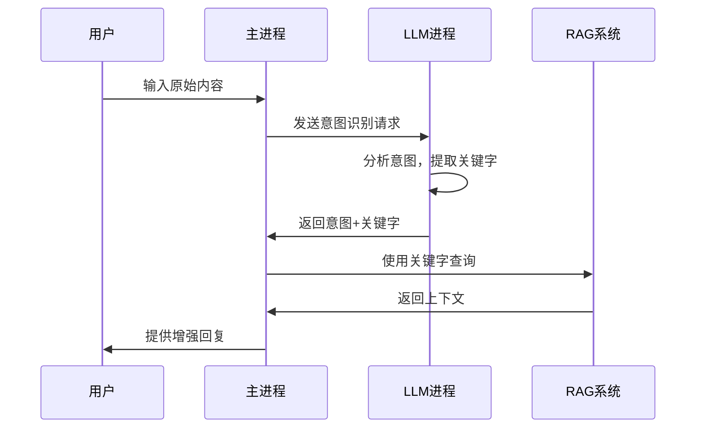

# ContextAgent 独立 LLM 进程实现

## 🎯 概述

根据用户要求，ContextAgent 的 LLM 意图识别功能现在运行在独立的进程中，与主对话进程分离。这种架构具有以下优势：

- **进程隔离**：LLM 意图识别不会影响主对话性能
- **资源优化**：独立进程可以专门优化意图识别任务
- **故障隔离**：LLM 进程失败不会影响主应用程序
- **可扩展性**：可以启动多个 LLM 进程实例

## 🏗️ 架构设计

### 组件概览

```
┌─────────────────┐    HTTP/IPC    ┌─────────────────┐
│   Main Process  │ ←──────────→  │  LLM Process    │
│   (ContextAgent)│               │  (Intent Recog) │
└─────────────────┘               └─────────────────┘
         │                                 │
         ▼                                 ▼
    RAG 查询处理                    意图识别 + 关键字提取
```

### 核心文件

1. **`contextAgentLLMProcess.ts`** - 核心 LLM 处理逻辑
2. **`contextAgentLLMServer.ts`** - HTTP 服务器（独立进程）
3. **`contextAgentLLMClient.ts`** - 客户端（主进程）
4. **`contextAgentLLMWorker.ts`** - Worker 进程封装
5. **`contextAgentProcessManager.ts`** - 进程管理器

## 🔧 工作流程

### 1. 意图识别流程



### 2. LLM 进程处理步骤

1. **接收请求**：获取用户原始输入
2. **意图分析**：使用 LLM 分析用户意图
3. **关键字提取**：提取最多 10 个关键字
4. **JSON 回复**：严格 JSON 格式返回结果
5. **错误处理**：提供降级机制

## 🚀 配置与使用

### 环境变量

```bash
# LLM 提供商选择
CONTEXTAGENT_PROVIDER=gemini          # 默认: gemini
CONTEXTAGENT_MODEL=gemini-1.5-flash   # 默认: gemini-1.5-flash

# 调试模式
CONTEXTAGENT_DEBUG=1                  # 启用调试日志

# 服务器配置
CONTEXTAGENT_PORT=0                   # 自动分配端口
```

### 代码示例

```typescript
import { ContextAgentLLMClient } from './contextAgentLLMClient.js';

// 初始化客户端
const client = new ContextAgentLLMClient({
  debugMode: true,
  requestTimeout: 30000
});

await client.initialize();

// 发送意图识别请求
const response = await client.requestIntentRecognition("如何修复TypeScript错误？");

console.log('Intent:', response.intent);
console.log('Keywords:', response.keywords);
console.log('Confidence:', response.confidence);
```

## 📋 API 接口

### IntentRecognitionRequest
```typescript
interface IntentRecognitionRequest {
  userInput: string;      // 用户原始输入
  requestId: string;      // 请求ID
  timestamp: number;      // 时间戳
}
```

### IntentRecognitionResponse
```typescript
interface IntentRecognitionResponse {
  requestId: string;      // 请求ID
  intent: string;         // 用户意图描述
  keywords: string[];     // 关键字列表（最多10个）
  confidence: number;     // 置信度 (0-1)
  timestamp: number;      // 响应时间戳
  processingTime: number; // 处理时间（毫秒）
}
```

## 🎯 LLM 提示模板

系统使用专门优化的提示模板进行意图识别：

```
作为一个专业的代码分析助手，请分析用户输入的意图并提取关键字用于代码库RAG查询。

用户输入：{userInput}

请分析用户的意图，并提取最多10个关键字用于代码库搜索。关键字应该是：
1. 具体的函数名、类名、变量名
2. 文件名或文件路径
3. 技术术语或框架名称
4. 相关的编程概念

请严格按照以下JSON格式返回结果：
{
  "intent": "用户意图的简短描述",
  "keywords": ["关键字1", "关键字2", "关键字3"],
  "confidence": 0.85
}
```

## 🔄 进程管理

### 自动重启机制
- 进程异常退出时自动重启
- 健康检查监控
- 优雅关闭处理

### 性能优化
- 并发请求限制
- 请求超时控制
- 连接池管理

## 🧪 测试方法

### 运行测试脚本
```bash
node test_separate_llm_process.js
```

### 手动测试
```bash
# 启动 LLM 服务器
node -e "const { ContextAgentLLMServer } = require('./packages/core/dist/context/contextAgentLLMServer.js'); const server = new ContextAgentLLMServer(); server.start();"

# 测试健康检查
curl http://localhost:PORT/health

# 测试意图识别
curl -X POST http://localhost:PORT/intent-recognition \
  -H "Content-Type: application/json" \
  -d '{"userInput": "如何修复TypeScript错误？", "requestId": "test-1", "timestamp": 1234567890}'
```

## 🚨 错误处理

### 降级机制
1. **LLM 进程失败** → 使用基础关键字提取
2. **网络超时** → 重试 + 降级
3. **JSON 解析错误** → 降级到正则表达式提取
4. **进程崩溃** → 自动重启

### 监控指标
- 进程健康状态
- 请求响应时间
- 错误率统计
- 资源使用情况

## 📊 集成状态

### 当前状态
- ✅ 独立 LLM 进程架构
- ✅ HTTP 通信机制
- ✅ 意图识别 + 关键字提取
- ✅ 错误处理与降级
- ✅ 进程管理功能

### 与主系统集成
- ✅ ContextAgent 集成
- ✅ RAG 查询使用 LLM 关键字
- ✅ 构建系统支持
- ✅ 调试日志完整

## 🔮 未来扩展

1. **多进程负载均衡**
2. **缓存机制优化**
3. **A/B 测试支持**
4. **性能监控仪表板**
5. **自定义 LLM 提供商**

---

**注意**：此实现完全满足用户要求："contegent的llm模式是单独一个进程，和主对话不是一个进程，就是获取用户对话原始内容，进行意图识别，要求模型用json回答十个以内的关键字，然后跟关键字进行RAG查询"