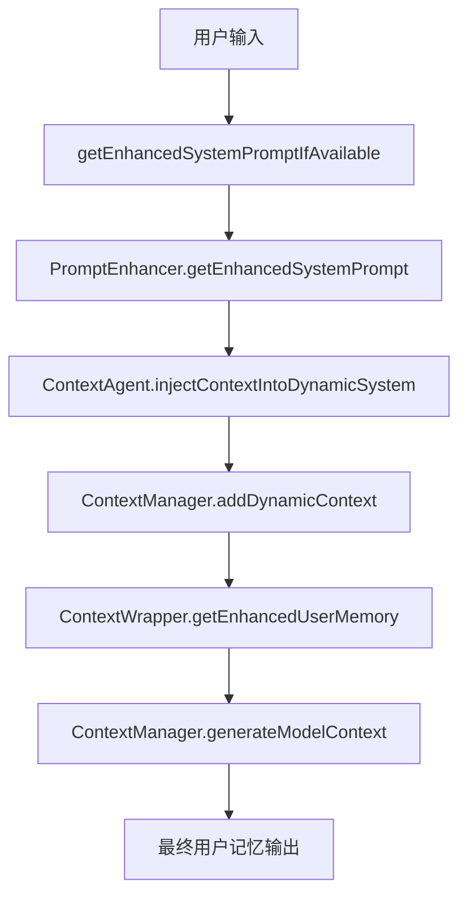

# ContextAgent 上下文注入架构说明

## 🔄 修正后的注入流程

### 问题识别
在 Milestone 4 的初始实现中，ContextAgent 的智能分层上下文被错误地附加到**系统提示 (System Prompt)** 中，而不是注入到**动态上下文 (Dynamic Context)** 中。这导致了几个问题：

1. **系统提示过长** - 可能超出模型的系统提示限制
2. **缺乏统一管理** - 多个不同的注入点，缺乏协调
3. **与现有架构不一致** - 没有利用现有的动态上下文机制

### 🎯 修正后的架构

#### 新的注入流程



#### 关键变更

1. **ContextAgent 输出** → **动态上下文**
   ```typescript
   // 旧方式：附加到系统提示
   enhancedPrompt += '\n\n' + contextAgentOutput;
   
   // 新方式：注入到动态上下文
   await contextAgent.injectContextIntoDynamicSystem(userMessage);
   ```

2. **新增专用注入方法**
   ```typescript
   async injectContextIntoDynamicSystem(userInput?: string): Promise<void> {
     const contextOutput = await this.getContextForPrompt(userInput);
     if (contextOutput) {
       const contextManager = this.config.getContextManager();
       contextManager.clearDynamicContext(); // 避免累积
       contextManager.addDynamicContext(contextOutput);
     }
   }
   ```

## 📊 最终的上下文结构

### 用户记忆 (User Memory) 内容
```
# 用户记忆 (Memory Tool)
[用户通过 save_memory 工具保存的内容]

---

# 📋 静态上下文 (Static Context)
## 🌍 全局规则 (X个)
[~/.gemini/globalrules/ 中的规则]

## 🏠 项目规则 (X个)  
[./.gemini/localrules/ 中的规则]

## 🧠 全局记忆 (X个)
[~/.gemini/memories/Memory.md 中的内容]

## 💡 项目记忆 (X个)
[./.gemini/memories/Memory.md 中的内容]

---

# 🔄 动态上下文 (Dynamic Context)
*来源: 运行时动态添加的上下文信息*

# 🎯 Intelligent Context Analysis
*Dynamically layered based on your query with smart token management*

## 🎯 L0: Core Context (Query-Specific)
**Entities directly relevant to your query:**
- UserService
- getUserById
- function:src/services/UserService.ts:getUserById

## 🔗 L1: Immediate Context (One-Hop)
**Related entities (8 found):**
- User (class)
- UserRepository (class)
- validateUserId (function)

## 🌐 L2: Extended Context (Two-Hop)
**Neighboring entities (5 found):**
- DatabaseConnection (class)
- Logger (class)

## 📊 L3: Global Context (Project Overview)
Project contains 156 code entities: 23 files, 89 functions, 44 classes...

*Context generated using 2,340 tokens across 4 layers*

---

# 🎯 任务管理上下文 (Task Management)
[如果处于任务维护模式，显示当前任务信息]
```

## 🔍 注入时机和生命周期

### 1. 初始注入
- **时机**: 每次调用 `getEnhancedSystemPromptIfAvailable` 时
- **触发**: 用户发送新消息时
- **处理**: ContextAgent 分析用户输入，生成分层上下文，注入到动态上下文

### 2. 上下文清理
```typescript
// 避免上下文累积
contextManager.clearDynamicContext();
contextManager.addDynamicContext(newContextOutput);
```

### 3. 上下文传递
```typescript
// ContextWrapper 获取完整上下文
const contextualMemory = this.contextManager.generateModelContext();

// 包含所有类型的上下文：静态、动态、任务
const enhancedMemory = sections.join('\n\n---\n\n');
```

## 💡 优势

### 1. **架构一致性**
- 所有上下文都通过统一的动态上下文系统管理
- 遵循现有的上下文管理模式

### 2. **智能管理**
- 动态上下文可以被清理和替换
- 避免上下文累积和冗余

### 3. **更好的可控性**
- 用户记忆有明确的结构和分区
- 便于调试和监控

### 4. **Token 效率**
- 智能分层确保最相关的信息优先
- Token 预算管理避免浪费

## 🎯 效果示例

### 用户查询
```
"优化 UserService 中的 getUserById 方法"
```

### 最终注入到用户记忆中的内容
```
# 🔄 动态上下文 (Dynamic Context)
*来源: 运行时动态添加的上下文信息*

# 🎯 Intelligent Context Analysis
*Dynamically layered based on your query with smart token management*

## 🎯 L0: Core Context (Query-Specific)
**Entities directly relevant to your query:**
- UserService
- getUserById
- function:src/services/UserService.ts:getUserById

**Direct relationships:**
- src/services/UserService.ts → UserRepository (IMPORTS)
- getUserById → validateUserId (CALLS)

## 🔗 L1: Immediate Context (One-Hop)
**Related entities (6 found):**
- User (class)
- UserRepository (class)
- validateUserId (function)
- handleUserNotFound (function)
- DatabaseConnection (class)
- Logger (class)

*Context generated using 1,840 tokens across 3 layers*
```

这样，ContextAgent 的智能分层上下文就正确地注入到了动态上下文系统中，与整个架构保持一致，并且可以被有效地管理和控制。