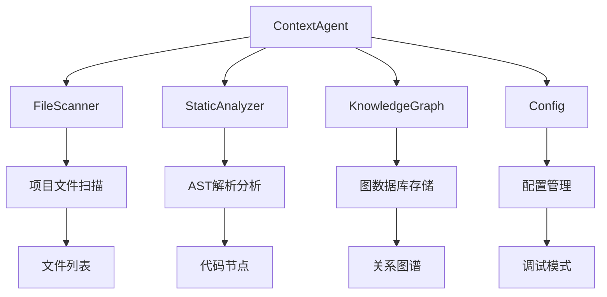
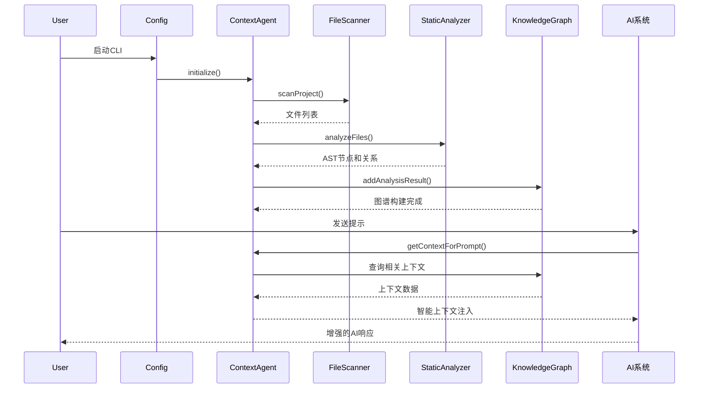
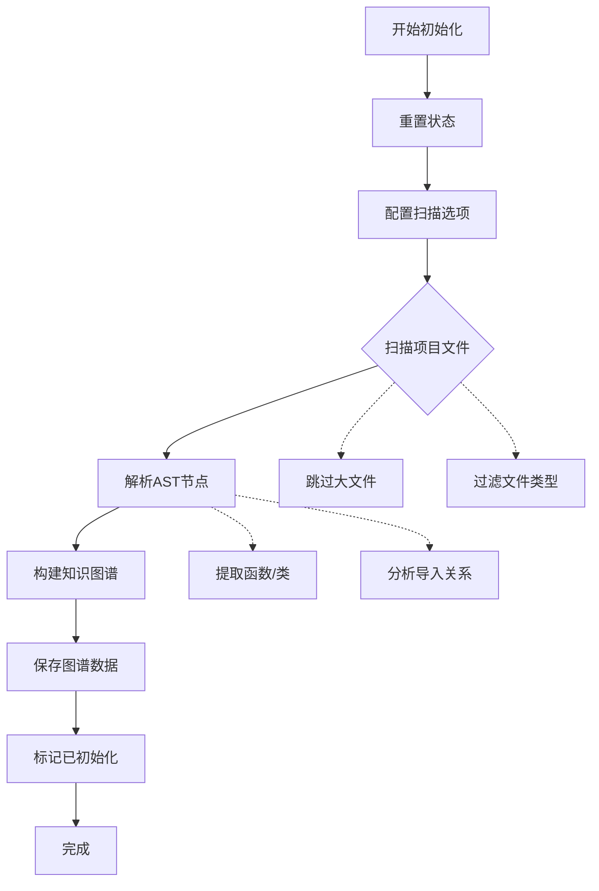
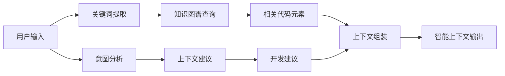
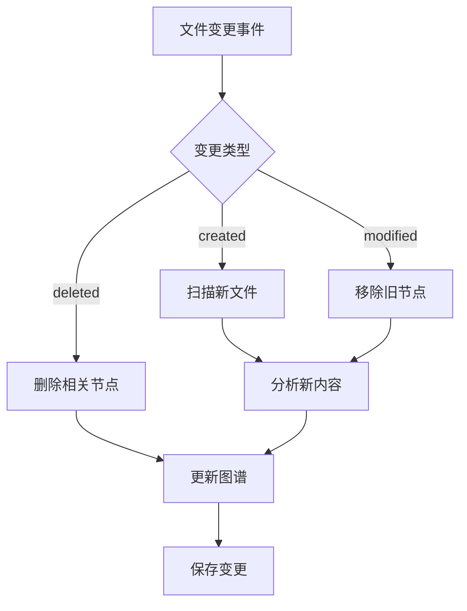

# ContextAgent 详细实现文档

## 概述

`ContextAgent` 是 Gemini CLI 的核心智能上下文系统，通过静态代码分析构建项目知识图谱，并为 AI 对话提供智能上下文注入。本文档详细描述了其实现机制、工作流程和调用方式。

## 架构设计

### 核心组件



### 数据流



## 详细实现

### 1. 初始化流程

#### `initialize()` 方法

```typescript
async initialize(): Promise<void>
```

**实现步骤：**

1. **清理状态** - 重置 initialized 标志
2. **项目扫描** - 使用 FileScanner 扫描源文件
3. **静态分析** - 使用 StaticAnalyzer 解析 AST
4. **构建图谱** - 将分析结果存储到 KnowledgeGraph
5. **持久化** - 保存知识图谱到磁盘



**调用时机：**
- CLI 启动时由 `Config.initialize()` 自动调用
- 用户执行 `/init` 命令时触发重新初始化

### 2. 上下文注入 (Milestone 3)

#### `getContextForPrompt()` 方法

```typescript
async getContextForPrompt(userInput?: string): Promise<string>
```

**增强功能：**

1. **项目架构概览** - 文件分布、函数统计、依赖关系
2. **结构洞察** - 文件类型分布、大文件识别
3. **查询相关上下文** - 基于用户输入的智能匹配
4. **意图分析** - 识别开发意图并提供建议
5. **最近变更** - Git 变更历史分析 (未来实现)



**上下文结构：**

```markdown
# 🧠 AI-Enhanced Project Context

## 🏗️ Project Architecture
- Code files: N analyzed
- Functions/methods: N discovered
- Classes/types: N identified
- External dependencies: N modules
- Relationships: N imports, N function calls

## 📁 Project Structure Insights
**File Distribution:**
  - typescript: N files
  - javascript: N files

**Largest Files:**
  - file1.ts (NKB)
  - file2.ts (NKB)

## 🎯 Query-Relevant Context
*Code elements related to your request:*
- function: `funcName` in `file.ts` (lines X-Y)
- class: `ClassName` in `file.ts` (lines X-Y)

## 💡 Contextual Suggestions
🐛 **Debug Mode**: Consider using error logs...
🧪 **Testing**: Look for existing test files...
```

### 3. 智能分析功能

#### 关键词提取 `extractKeywords()`

**提取内容：**
- 标识符 (camelCase, snake_case, PascalCase)
- 文件扩展名
- 引用字符串
- 排除停用词

#### 意图分析 `analyzeUserIntent()`

**识别模式：**
- **调试** - bug, error, fix → 提供调试建议
- **测试** - test, testing → 测试模式建议
- **重构** - refactor, optimize → 重构注意事项
- **新功能** - add, new, create → 集成指导

#### 项目洞察 `getProjectStructureInsights()`

**分析维度：**
- 文件类型分布统计
- 大文件识别 (>1KB)
- 代码质量指标

### 4. 增量更新 (Milestone 2)

#### `processFileChange()` 方法

```typescript
async processFileChange(filePath: string, changeType: 'created' | 'modified' | 'deleted'): Promise<void>
```

**处理逻辑：**



## 调用方式和触发机制

### 1. 自动触发

#### 系统启动
```typescript
// Config.initialize() 中
const contextAgent = new ContextAgent({
  config: this,
  projectDir: this.targetDir,
  sessionId: this.sessionId
});
await contextAgent.initialize();
```

#### 上下文注入
```typescript
// index.ts getEnhancedSystemPromptIfAvailable() 中
const contextAgent = config.getContextAgent();
if (contextAgent?.isInitialized()) {
  const contextAgentOutput = await contextAgent.getContextForPrompt(userMessage);
  if (contextAgentOutput) {
    enhancedPrompt += '\n\n' + contextAgentOutput;
  }
}
```

### 2. 手动触发

#### 重新初始化命令
```typescript
// initCommand.ts 中
const contextAgent = config.getContextAgent();
await contextAgent.reinitialize();
```

#### 文件变更监听
```typescript
// 文件系统监听器中
await contextAgent.processFileChange(filePath, 'modified');
```

## 性能优化

### 1. 扫描限制
- 最大文件数: 2000
- 跳过大文件: >100KB
- 忽略模式: .gitignore + 内置模式

### 2. 缓存机制
- 知识图谱持久化存储
- 增量更新避免全量重建
- 上下文生成结果复用

### 3. 错误处理
- 初始化失败不影响 CLI 正常使用
- 单文件分析错误不中断整体流程
- 优雅降级：无上下文时返回空字符串

## 调试和监控

### Debug 日志
```typescript
if (this.config.getDebugMode()) {
  console.log('[ContextAgent] Generated enhanced context: X characters');
  console.log('[ContextAgent] Context sections: X');
}
```

### 统计信息
```typescript
const summary = await contextAgent.getSummary();
// 返回状态、能力、统计数据、最近活动
```

## 未来扩展 (Milestone 4+)

1. **语义搜索** - 基于语义相似度的上下文匹配
2. **Git 集成** - 变更历史分析和热点文件识别
3. **依赖分析** - 跨文件依赖关系图谱
4. **智能建议** - 基于代码模式的重构建议
5. **实时监听** - 文件系统事件实时更新

---

这个设计实现了智能上下文感知，为 AI 助手提供了项目相关的结构化信息，显著提升了对话质量和代码理解能力。